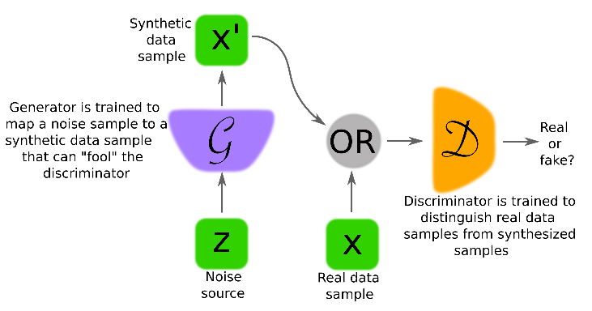
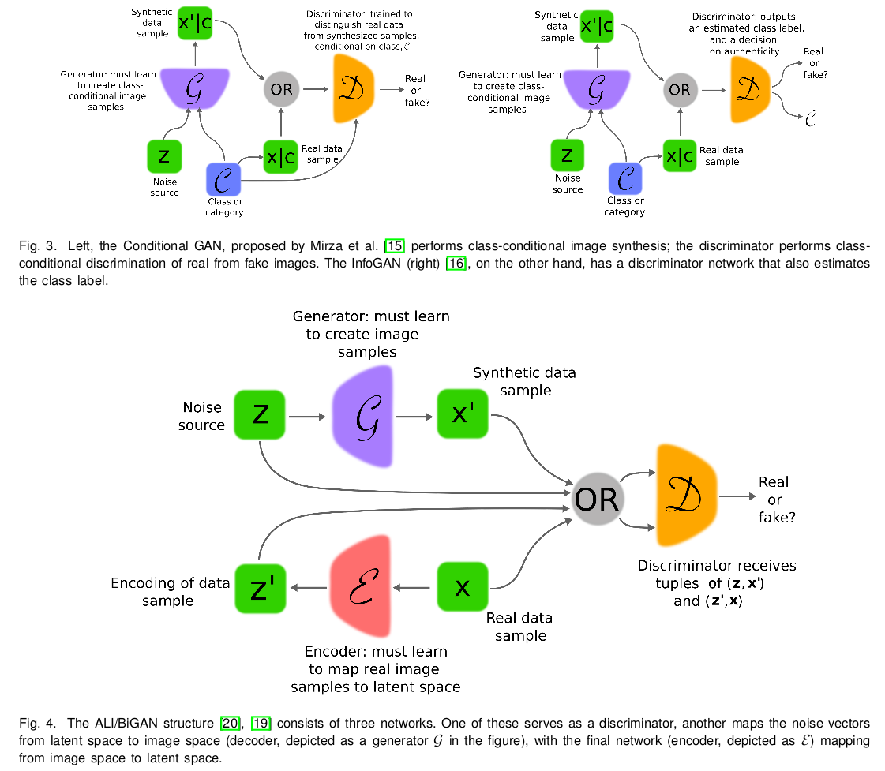

# 20171030-20171105 论文笔记 1

> 我的研究方向是[生成式对抗网络 GAN](https://github.com/iamkissg/PaperHighlights/tree/e748838bc232093f9685c22210ec5bff856cf116/img/2017-11-05-papernotes_44/https:/en.wikipedia.org/wiki/Generative_adversarial_network/README.md), 这段时间读的都是 GAN 的相关论文, 我会慢慢地把都读过的论文的笔记上传到 [Github](https://github.com/Engine-Treasure/papernotes) 以及博客上来. 由于本期涉及 GAN 的开山之作与一篇综述, 内容比较多, 暂时就放 3 篇笔记.

## [Generative Adversarial Nets](https://github.com/iamkissg/PaperHighlights/tree/e748838bc232093f9685c22210ec5bff856cf116/img/2017-11-05-papernotes_44/https:/papers.nips.cc/paper/5423-generative-adversarial-nets.pdf)

本文是 GAN 的开山之作.

GAN 由两个神经网络组成, 一为`生成器 Generator`, 一为`判别器 Discriminator`. 生成器用于捕捉\(真实\)数据的分布; 判别器用于估计\(输入它的\)样本是真实数据的概率, 从而能够指导生成器的训练.

GAN 存在唯一的解, 即`生成器能恢复真实的数据分布, 判别器的输出处处为 1/2`

> 对于以下相关工作的描述, 我自己也没有研究过, 不曾体会, 暂且做个记录.

GAN 是深度生成模型的一个变种. 但后者存在以下两个难点, GAN 避免了这两个难点.

1. 近似\[\(极大似然估计与相应策略\)的概率计算\]的难度很大; \[此处加两个括号, 辅助断句, 读者请自行体会\]
2. 在生成上下文使用分段线性单元难以获益.

### 相关工作

`深度玻尔兹曼机 DBM` 广泛地使用似然函数, 因此需要对似然梯度的大量估计. 这些困难推动了`generative machine`的发展, 这些模型不需要显式地表示似然, 能够从期望的分布中生成样本. 其中的一个例子是`Generative stochastic networks GSN`, 它可以通过 BP 训练 而不需要大量的近似. 而 GAN 通过剔除 GSN 中使用的`马尔可夫链`拓展了 generative machine.

`Variational AutoEncoders VAEs` 同样给可微的生成器网络配了另一个神经网络, 该网络作为识别模型, 用于近似推断. VANs 与 GANs 的不同之处在于, GANs 需要通过可见单元进行微分, 因此不能对离散数据建模; VAEs 需要通过隐藏单元进行建模, 因此不能有离散`潜变量`.

`Predictability minimization PM` 也使用了两个神经网络相互竞争的思想. 其第一个网络的每个隐藏单元都训练为和第二个网络的输出不同, 而第二个网络预测每个隐藏单元在给定所有其他隐藏单元的值时的值. GAN 与 PM 的不同在于:

1. 网络间的竞争是 GAN 的唯一训练标准; PM 只是鼓励隐藏单元统计独立的正则器, 竞争并不是主要标准;
2. GAN 中的生成器生成丰富的高维数据, 作为判别器的输入, 力图使判别器最终无法判断数据的真假; 而 PM 比较两个神经网络的输出, 一个使输出相似, 一个使输出不同, 最终得到一个标量;
3. GAN 是基于 minmax 博弈的, 而不是优化问题, 存在一个`值函数 Value Funtion`, 判别器致力于增大其输出, 生成器致力于减小该值, 博弈在鞍点处停止; 而 PM 是一个优化问题, 方法是最小化观测函数.

另一个与 GAN 的思想相似的是`Noise-contrastive estimation NCE`, 它通过训练一个生成模型来学习能帮助区分判定性数据与固定噪声分布的模型权重. NCE 的限制是, 它的"判别器"定义为噪声分布与模型分布的概率密度比, 因此需要对两个概率密度都进行评估与 BP.

`对抗样例`是对分类网络的输入直接应用基于梯度的优化方法找到的样例, 目的是找到与数据相似但会被误分类的样例. 因此对抗样例主要是一种分析工具. 但是对抗样例的存在, 意味着 GAN 的训练可能是低效的, 因为它使得判别器能够自信地识别一个类, 但缺少对人类对于物类的感知的模拟.

GAN 的架构如上图所示. 生成器的输入为噪声, 通过训练其参数, 以恢复真实数据分布. 深度学习作为一种表示学习方法, 一般的深度神经网络对数据处理过程可以视为一个编码过程, 而此处的生成器可以视为一个解码过程.

判别器则接受来自真实数据集或生成器生成的样本, 输出一个标量, 用以表示样本来自真实数据集的概率.

GAN 的 minmax 博弈的值函数表示如下:

在 GAN 训练的早期, G \(以下均用 G 表示生成器, D 表示判别器\) 非常差劲, 其输出结果明显不同于真实数据, 因此 D 能以绝对的自信判定真假, 输出接近 1 或 0 的概率, 导致 G 的梯度消失 \($log\(1 - D\(G\(z\)\)\)$饱和\), 从而难以训练 G. 此时使用最大化 $log D\(G\(z\)\)$ 而不是最小化 $log\(1-D\(G\(z\)\)\)$ 会有所帮助. 因为该观测值使得 G 与 D 的动态具有相同的定点, 因此能在训练早期提供更强的梯度. \(此处, 我不明白\)

本文后面的内容从理论上证明了以下两项, 具体证明过程在此略去:

1. minmax 博弈在 $\mathcal{p_g} = \mathcal{p_{data}}$ 达到全局最优解.
2. 当 G 与 D 有足够的容量时, 在给定 G 时, D 能达到最优值, 而 $\mathcal{p}$ 也能得到更新, 以提升 G.

实际应用中, GAN 通过函数 $G\(\mathcal{z};\theta\_g\)$ 来表示 $\mathcal{p\_g}$ 的一个受限族, 并且优化的是 $\theta\_g$ 而不是 $\mathcal{p\_g}$. 因此 GAN 实际缺乏理论保障.

`KL 散度`用于度量一个概率分布偏离量一个分布的程度. 而 `JS 散度` $D\_{JS}=\frac{1}{2}\(KL\(P\mid\mid\frac{P+Q}{2}\) + KL\(Q\mid\mid\frac{P+Q}{2}\)\)$ 可用于度量两个概率分布之间的相似性. GAN 训练的一个目标就是减小真实概率分布与生成概率分布之间的 JS 散度.

GAN 的缺点:

1. 没有显示地表示 $\mathcal{p\_g}$
2. D 必须与 G 同时训练

GAN 的优点

1. 不需要马尔可夫链, 只需要 BP 来计算梯度
2. 学习过程中不需要推理
3. 可以使用多种技术
4. G 不是直接依据数据样本来更新的, 而是依据判别器的梯度, 这意味着输入并不是直接拷贝进 G 的参数的
5. 可以表示非常锐化, 甚至退化的分布 \(基于马尔可夫链的方法要求分布具有一定的模糊性, 以便链在模式间混合\)

## [Generative Adversarial Networks: An Overview](https://github.com/iamkissg/PaperHighlights/tree/e748838bc232093f9685c22210ec5bff856cf116/img/2017-11-05-papernotes_44/https:/arxiv.org/pdf/1710.07035.pdf)

这是近期新出的 GAN 的综述.

GAN 要求 G 与 D 必须是可微的, 但不要求它们是直接可逆的

### GAN 的架构

`LAPGAN` 通过多次放缩, 对生成过程进行分解解决了\(使用\(相同容量\)和\(与监督学习的表示能力相同的 CNN\)来训练 G 和 D 很困难\)的问题, 并使用`条件卷积 GAN`来生成每一层的图像. \[此处的圆括号用于辅助断句\]

`DCGAN` 利用了 strided 和 fractionally-strided 卷积来分别支持降采样与上采样操作. 这些操作能处理采样速率与采样位置的变化, 而这正是将图片空间映射到可能的低维潜变量空间及将图片空间映射到 D 的一个关键.

`Conditional GAN` 提供了对多模式数据生成的更好的表示.

`InfoGAN` 将噪声源分解为不可再分解的源与一个`潜代码 latent code`, 并试图通过最大化潜代码与 G 输出之间的交互信息来发现变量的潜在因子. 实验表明 InfoGAN 习得的表示在语义上是有意义的.

`Adversarially Learned Inference, ALI` 与 `Bidirectional GAN` 是带推理模型的 GAN, 引入了推断网络, 能在 D 检测 \(data, latent\) 对时提供帮助. 而此时, G 由两部分组成, 除了常规的解码器, 还有一个额外的推断网络作为编码器.

`Adversarial Autoencoders, AAE` 将对抗的思想引入自编码器. 在潜变量空间与其期望先验分布间引入对抗训练, 从而得到一个组合损失函数, 它反映了重构误差以及由候选编码网络产生的先验分布有多不同的一种度量. `Adversarial Variational Bayes, AVB` 试图优化与 VAE 相同的标准, 但使用对抗训练的观测而非 KL 散度.

### 训练 GAN

理想情况下, 针对当前 G, D 会训练到最优; 然后训练 G. 但实际中, D 可能不会训练到最优状态, 只会进行有限的几次迭代训练, 并且 D 与 G 同时训练更新.

GAN 实际是要找到一个鞍点, 因此梯度下降算法对于 GAN 的训练并不合适.

真实数据只是高维空间中的一个低维流形, 因此训练 G 来恢复真实数据分布, 在空间中也只是很小的一块区域. 由于 $\mathcal{p_g}\(x\)$ 与 $\mathcal{p_{data}}\(x\)$ 很可能是不重叠的, 因此 D 可能总会以极高的自信判别真假

当 D 最优时, 训练 G 等价于最小化 $\mathcal{p_g}\(x\)$ 与 $\mathcal{p_{data}}\(x\)$ 间的 JS 散度 \(如上所述\); 但 D 不是最优时, 对 G 的更新可能是无意义, 或者不准确的

* GAN 的训练技巧
  * 同时对 G 和 D 使用 Batch Normalization, 能使训练更深的模型的过程更稳定
  * 最少化全连接层, 以提高训练更深模型的灵活性
  * LeakyReLU 比 ReLU 具有更好的性能
* 训练 GAN 的启发式方法:
  * 稍微修改 G 的观测目标能提高可获得的信息量. 特别地, D 的训练方法不变, 但训练 G 来匹配 D 的中间层的激活值
  * 小批量判别. 向 D 添加一个额外的输入, 该特征对小批量中的一个样本与其他样本的距离进行编码, 旨在防止`mode collapse`, 因为此时 D 能轻易地知晓 G 是否总是输出同一个结果.
  * 启发式平均. 当参数偏离之前的均值时, 对其进行惩罚, 以保证博弈能收敛到一个均衡点.
  * `Virtual BN`. 在训练之前, 选择一个小批量的数据, 记为引用小批量, 以后每次训练, 都使用引用小批量的统计量, 从而减少小批量中某个样本对其他样本的依赖.
  * one-sided 标签平滑. 即用略小于 1 的数字来表示标签 1, 这使得 D 的分类边界更加平滑, 防止了 D 的过度自信, 从而防止了 G 的梯度消失.
  * 在样本送入 D 之前, 向其添加噪声. Sønderby et al. 指出 one-sided 平滑会使得 D 偏离最优解的情况. 而使用实例噪声, 能使得真实流形与生成流形彼此更接近, 同时防止了 D 轻易就找到完全分离真假样本的判别边界. 实践中, 这通过同时向真假样本添加高斯噪声实现.

Nowozin et al. 指出, GAN 的训练可能可以被泛化为不仅仅最小化 JS 散度, 而且最小化 f-散度的估计, 并提出了 f-GANs. f-GANs 在训练之初, G 的梯度不太容易消失. 这是因为, 训练 D 时, 估计了真假数据分布的 f-散度的偏差,而在训练 G 时, 仅最小化 f-散度的估计. f-GANs 后又得到扩展, 训练 D 时, 预测真假数据分布的比例; 训练 G 时, 直接最小化 f-散度.

WGAN 使用了 Wasserstein 距离的近似作为成本函数, 这能为 G 提供更有用的梯度.

最近的研究表明, `权重剪切 weight clip` 较小了 D 的容量, 强迫它学习更简单的函数.

BiGAN 和 ALI 提供了图片到潜变量空间的映射, 但重建的品质并不高

### 潜变量空间结构

潜变量空间的数据可以被高度结构化, 从而可能支持高级的语义操作

一些 GANs 变种提供了从图片到潜变量映射的网络, 因此能够探索和利用结构化的潜变量空间. 通过编码器, 带标签的数据集可以映射到潜变量空间, 从而发现能表示高层属性的"概念向量".

Gurumurthy et al. 对`混合高斯分布`的潜变量空间进行建模.

### GAN 的应用

> 此处仅对应用做一个简单的记录

* 分类与回归
  * GAN 训练完成之后, 神经网络可以复用于下游任务. D 的卷积层可用于特征提取, 只需要在其上添加简单的线性模型即可
  * 通过推断机制的联合训练, 能提供数据表示的品质. \(当在训练路径中注入标签信息, ALI 取得了 state-of-the-art 的分类结果\)
  * 在标签有限的情况下, 对抗训练可用于生成更多的训练样本
* 图片生成
  * GAN 的条件化后来被扩展到自然语言中, Reed et al. 用 GAN 从文本描述中生成图片
  * 作为文本描述的扩展, GAWWN 条件于物体位置
* 图片到图片的转化
  * pix2pix 用于图片到图片到"翻译"
  * CycleGAN 通过引入循环一致性损失, 尝试在转化之后保留原始图片, 并反转转化过程.
* 超分辨率
  * SRGAN 通过对抗损失组件扩展了之前的模型, 限制图片在自然图片的流形之上.

## [Conditional Generative Adversarial Nets](https://github.com/iamkissg/PaperHighlights/tree/e748838bc232093f9685c22210ec5bff856cf116/img/2017-11-05-papernotes_44/https:/arxiv.org/pdf/1411.1784.pdf)

这是一篇比较短小的论文. 就提出了一个概念: `同时向 G 和 D 输入相同的额外信息, 引导生成过程`. 这些额外信息也称为条件, 可以是类标签, 或者是其他任何辅助信息.

这个方法很实用. GANs 原来是漫无目的的生成样本的, 加入条件之后, cGAN \(我喜欢称`条件 GAN` 为 cGAN\) 就真正实现了指哪打哪, 可以定向生成样本, 比如 MNIST 的数字 5 \(Give me 5!\)

cGAN 的值函数见下, 架构见上.

