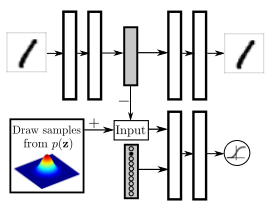
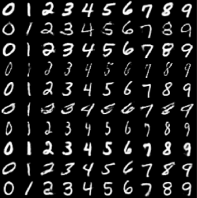
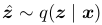
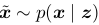
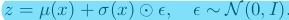
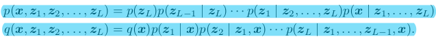
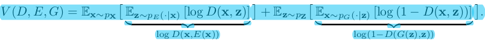

# 20171127-20171203 论文笔记 1

> 手头上挤压了比较多看完但未整理的论文. 今后, 我尽量看完就做一个简单的记录, 后续如果回过头精读, 那就再说吧.

## Adversarial Autoencoders

> 论文地址: [https://arxiv.org/pdf/1511.05644.pdf](https://arxiv.org/pdf/1511.05644.pdf)

如题所示, 本文基于 GAN 提出了对抗自编码器, 执行`变分推断 variational inference` 来匹配自编码器的潜变量的后验分布与任意的先验分布. 该匹配过程保证了从先验空间的任意部分都能生成有意义的结果.

近年来, 深度生成模型的训练主要都基于 `MCMC 马尔可夫链蒙特卡罗(搜索)` 算法. 使用 MCMC 方法的一个缺点是: 随着训练的进行, 其计算得到的对数似然的梯度变得越来越不精确, 因为从马尔可夫链采样的样本无法足够快地混合入模型.

后来的 `变分自编码器 VAE` 则是利用`识别网络 recognition network`来预测潜变量的后验分布.

`对抗自编码器 AAE` 有两个训练目标: 一个重构错误标准, 一个对抗训练标准. 后者用于匹配自编码器潜变量表示的后验分布与任意的先验分布. 其结构如下所示.

从"1"到"1"的网络是自编码器, `红框中的是自编码器的编码器部分, 也是 GAN 的生成器`. 与之前所见 GAN 不同的是, 这个 GAN 的真实数据是前文提到的先验分布 p(z), 而生成数据则是自编码器的结果后验 q(z). AAE 中的 GAN 的目标就是指导 q(z) 匹配/拟合 p(z).

而自编码器本身的目标, 就是最小化重构误差.

一旦 AAE 训练完成, 其解码器就能够作为一个生成模型, 利用 p(z) 生成样本, 比如自然图片.

AAE 与 VAE 的不同在于: VAE 使用 KL 散度惩罚来利用自编码器的潜变量的先验分布; AAE 则使用对抗训练的方式来匹配自编器得到的后验与其他先验分布. 在 VAE 中, 通过蒙特卡罗采样的 KL 散度来反向传播, 需要先验分布的明确泛函形式; 而 AAE 只需要能够从先验分布中, 就能引导 q(z) 匹配 p(z).

VAE 最小化 x 的负对数似然的上界, 表达式如下:

可以看到变分边界由 3 部分组成, 第一部分可以看作自编码器的重构项, 第二三项则可以看作是正则项. 其中第二项鼓励后验分布 q(z) 具有大方差, 第三项则最小化 q(z) 与 p(z) 之间的交叉熵. 在 AAE 中, 保留第一项, 将后两项替换为对抗训练过程, 以驱使 q(z) 去完全匹配 p(z).

AAE 与 GAN 的不同在于: GAN 通常利用神经网络输出层的像素级的数据分布; 而 AAE 倚赖自编码训练来捕获数据分布. 在 AAE 的训练过程中, 可以令 q(z) 去拟合更低维度的更简单的分布. (这就起到了简化和降维的作用)

`Generative Moment Matching Networks` 利用`最大平均差异 Maximum Mean Discrepancy`来对神经网络的输出分布进行变形. MMD 可以解释成最小模型分布与数据分布的所有`Moment 矩`的距离.

AAE 与 GMMN+AE 的最大区别在于: 对抗训练过程作为`regularizer 正则器`从训练开始就对 q(z) 进行修改; 而 GMMN+AE 首先训练一个标准的 Dropout 自编码器, 然后去拟合预训练的自编码器的潜变量分布.

文中利用如下的结构, 将标签信息注入 AAE, 有点像将 GAN 替换为 cGAN. 不同的是, 以下的结构只将标签信息作为 D 的输入, 并以`半监督`的方式进行训练. 如图所示, 标签以 one-hot 的形式表示, 其功能类似一个开关, 根据文章描述, 它用于选择相应的 D 的决策边界.

整个无监督学习的过程和[上一篇](45_1.md)所描述的有些相似, 读者不妨对比着看. 10 维的 one-hot 向量实际包含 11 个类信息 (都不激活, 可以表示一种情况). 文章此处使用 10 个二维高斯混合分布来表示潜变量 z 的分布. 前 10 个类中的每一个都对应一项二维高斯分布. 而额外的类对应无标签的训练数据, 当无标签数据输入模型, 对应额外的类, 将为整个混合高斯分布选择一个决策边界.

进行对抗训练时, 训练 D, 通过 one-hot 向量向 D 输入混合高斯组件对应标签, (这里有点凌乱, 我的理解就是输入 p(z) 和标签信息), 无标签数据的 p(z) 就采样自整个混合高斯; 训练 G 时, 就向 D 输入训练样本对应的标签.

近年来, 生成模型成为半监督学习的最流行的方法, 是因为它们能`依据某种规则将类标签信息与其他变分的潜因子分开来`.

文章以下图所示的结构来训练监督 AAE, 以分离类标签与图片风格信息. 可见, 解码器利用标签的 one-hot 向量表示和潜变量 z 来重构图片. 该架构迫使神经网络将独立于标签的所有信息都保存到 z 中.

效果是这样的, 以下每一行表示 AAE 学习到的数字独立于标签的某种风格.

> 实践经验, ALI 的架构中有部分层同时使用了 BN 和 Dropout. 我自己一开始没有注意它们的先后关系. 网上的指导建议是: Dropout 放在最后.
> 另一个问题是, BN 放在非线性激活函数之前还是之后. BN 的论文 (稍后会放出笔记) 中说放在激活函数之前, 但近来的使用趋势是放在激活函数之后.
文中又提出一种半监督学习的结构, 不过这次半监督学习的类别信息, 如下所示. 相比于上面监督学习的结构, 多了一个对抗网络用于学习图片的类别, 它确保潜变量 y 不携带风格信息, 而 y 的后验分布 (即编码器得到的 y) 匹配分类分布.

在半监督学习的架构之上, 文中又移除了半监督分类步骤, 进行无监督聚类实验.

非参数的降维技术缺陷是, 由于缺少参数, 新的数据无法在嵌入空间中找到位置. (除非对整个数据集重新降维); 自编码器也被用于数据降维, 然而非正则的自编码器将流形"打断"进不同的空间位置, 导致相似的图片的潜代码不同.

最后, 文中以如下的结构进行降维实验. `对抗正则 adversarial regularization`的过程将相似图片的潜代码聚集在一起, 从而防止了流形的破碎.

相比之前的架构, 该架构将 one-hot 表示的 m 维数据乘以一个 mxn 的矩阵 (n < m), 得到一个 n 维的表示, 实现降维. 此外引入了一个成本函数来惩罚两个簇头之间的欧式距离.

本文提出了以 GAN 框架作为概率自编码器的变分推断算法, 并调研了许多应用方式, 到此终于结束了. 我几乎把文中提出的研究都复述了一遍, 就是希望能给读者一个 AAE 能干嘛的清晰认识, 又省略了一些数据与图, 读者可去论文中翻看.

## Adversarially Learned Inference

> 论文地址: [https://arxiv.org/pdf/1606.00704.pdf](https://arxiv.org/pdf/1606.00704.pdf)

> 作者之一的博客: [https://ishmaelbelghazi.github.io/ALI/](https://ishmaelbelghazi.github.io/ALI/)

与上篇类似, 本文介绍的`对抗学习推理 ALI`, 使用对抗的方式联合训练了一个生成网络与一个推断网络. 生成网络就是 GAN 中的 G, 将随机潜变量映射到数据空间, 而推理网络 (以下简称 I) 将训练样本从数据空间反映射到潜变量空间. 因此, 对抗博弈在 G, I 与 D 之间展开.

基于 VAE 的技术, 通过最大化数据 x 的对数似然来引入随机潜变量 z, 并最大化他们的联合分布 p(x, z). 但由于潜变量的确切边缘分布通常难于追踪, VAE 引入了一个近似后验 q(x, z), 并最大化 p(x) 的对数似然的变分下界.

基于极大似然估计法的模型会显得保守, 概率质量将扩散到整个数据空间. (Theis et al.2015) 以生成图片为例, 基于 VAE 的模型会模糊化.

GAN 能得到一个生成高品质样本的生成模型. 但它没有一个有效的推理机制. 因此本文将`推理机制`与`深度有向生成模型`注入 GAN-like 的对抗框架, 得到 ALI, 其结构简图如下所示.

左框表示一个 I, 将真实训练样本 x 映射到潜变量空间, 得到 z_hat; 右框表示一个 G, 将潜变量 z 转化为生成样本 x_hat. 而 D 被训练为识别 (x, z_hat) 与 (x_hat, z).

ALI 的 G 和 I 可以分别看作`编码器 encoder`和`解码器 decoder`, 它们的联合分布可以看作如下形式:

* 编码器的联合(概率)分布 q(x, z)=q(x)q(z|x)
* 解码器的联合分布 p(x, z)=p(z)p(x|z)

因此, 输入 D 的 (x, z_hat) 和 (x_hat, z) 分别就代表了两个联合分布.

当 ALI 的训练完成, 两个联合分布匹配之后, 可以假定所有的边缘分布和条件分布都匹配了. 比如可以认为条件概率 q(z|x) 匹配了后验概率 q(z|x).

ALI 的值函数如上所示. 和 GAN 的值函数的区别仅在于 D(x)=> D(x, Gz(x)), D(G(z))=>D(Gx(z), z).

为了使梯度能够从 D 传递到编码器和解码器, 梯度需要流过两个采样过程  和 . 对此, 本文使用了`重参数化 reparametrization` 技巧, 即不直接从期望的分布中采样, 而是对服从期望分布的噪声进行转换以计算随机变量. 比如 , 可通过下式计算:

本文还提到, 可以扩展 ALI 的框架至多个随机层. 什么叫多个随机层呢, 是这样的, 不要和多层神经网络搞混了:

你会发现 ALI 和上文的 AAE 很像, 本期所选的三篇论文都很相似. (我想到类似的方法, 无奈前人已经做了, 只好化悲愤为苦读.) 和 AAE 不同的是, ALI 旨不在优化重构损失, 且 D 的输入是 (x, z) 对 而不是边缘样本 z.

重要的事情多提几遍: `Batch Normalization` 对于 GAN 的训练真的很关键! 但不用于 G 和 I 的输出层, 为了稳定训练过程, 也没有应用于 D 中受 z 影响的层.

本文的几个实验发现是:

* 样本对之间的过渡很平滑, 中间生成的图片也很真实 (他们对于潜变量空间的研究是, 选取 z1, z2, 然后进行线性插值, 观察中间 z 生成的图片). 这表明 ALI 并没有将概率质量仅仅置于训练样本上, 也扩散到了其他有助于生成的潜在特征.
* 尽管 ALI 没有针对重构品质 (quality) 进行优化, 但实际的重构效果很好. 这表明条件概率 q(z|x) 很好地近似了后验概率 p(z|x)
* 实验结果表明, ALI 的重构没有专注于像素级的精准, 比如捕获物体的位置, 颜色, 风格等会犯错, 但它能表示更抽象的特征, 这表明, ALI 的潜变量表示对于一些不那么有趣的因素具有更高的不变性, 不会分配更多的能力去捕获它.

最后, 本文的附录贴上了超详细的模型超参数表, 可以很方便地复现实验, 点赞. 此外还有一个很有意思的小彩蛋, 有时间我会翻译出来贴出来.

> 实践经验, ALI 的架构中有部分层同时使用了 BN 和 Dropout. 我自己一开始没有注意它们的先后关系. 网上的指导建议是: Dropout 放在最后.
> 另一个问题是, BN 放在非线性激活函数之前还是之后. BN 的论文 (稍后会放出笔记) 中说放在激活函数之前, 但近来的使用趋势是放在激活函数之后.

## Adversarial Feature Learning

> 论文地址: [https://arxiv.org/pdf/1605.09782.pdf](https://arxiv.org/pdf/1605.09782.pdf)

本文提出了 Bidirectional GAN (以下简称BiGAN), 其网络结构与 ALI 极像. 如下所示 (这两篇论文同时被 ICLR2017 收录)

就连值函数, BiGAN 与 ALI 几乎也是一样的:

与 ALI 相同的概念, 以下不再赘述. 相比 ALI, 本文的证明性更强, 各种数学推理, 仅摘录结论. 欲了解更多的同学直接看原文吧. (我表示看不太懂这诸多推理)

本文指出, 当达到全局最优时, G 与 E (从 x 到 z 的编码器) 是双射函数, 且互为逆, 即 E=G^-1. BiGAN 近似于一个带 l0 损失函数的自编码器.

本文还指出, 最优的 D 必须是随机的, 但由于次优的 G 与 E, D 不可能达到随机的状态

不同于正则的自编码器, lo 损失函数不对数据分布或结构做任何假设; BiGAN 的所有的结构化属性都由 D 习得.

在原始 GAN 中, 交替真实与生成样本以向 G 提供更强的梯度. 但 BiGAN 提供的"可逆"观测值能为 G 和 E 提供足够强的梯度. 因此, 本文使用在一次迭代中, 同时更新 D, G, E 的方法.

如本文标题显示的, BiGAN 旨在学习有意义的特征表示. 文中是这样描述的: 原始 GAN 中, D 接收样本作为输入, 并将其习得的中间表示作为相关任务的特征表示, 再没有额外的机制. 它对于生成数据与真实数据的语义上有意义的特征并不十分清晰. 事实上, 当 G 生成了真实数据时, D 可逆会完全忽略生成数据而无条件地预测 p=1/2, 学不到任何有意义的中间表示. BiGAN 就是希望让 GAN 习得有意义的表示.
