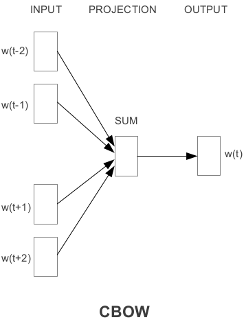
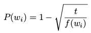
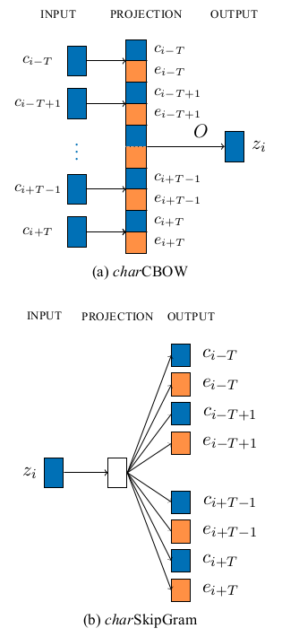
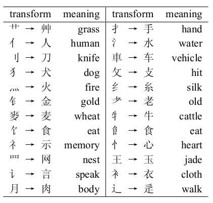
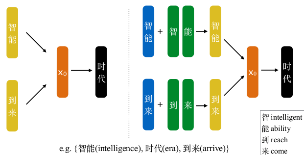
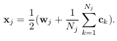
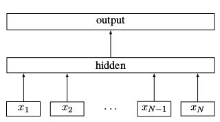
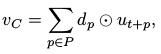

# 20180108-20180114

## Efficient Estimation of Word Representations in Vector Space

本文是 word2vec 的第一篇, 提出了大名鼎鼎的 CBOW 和 Skip-gram 两大模型.

> 由于成文较早, 本文使用的一些术语有一些不同于现在的叫法, 我都替换为了现在的叫法.

CBOW 的架构如下所示. 与作者提到的 feedforward NNLM 的架构`input->linear->hidden->output`很像. 作者发现模型复杂性主要来自 non-linear hidden layer, 因此去掉了它. 由于 linear layer 被所有 words 共享, 所有 words 都会被映射到同一片空间. CBOW 所要做的就是利用一个单词前后的单词, 称为其`上下文, context`来预测它.



> 图中的 Projection layer 就是 linear layer

Skip-gram 模型如下所示. 看上去与 CBOW 正好相反, 它接受一个单词作为输入, 预测在其上下文中的单词们. 文中提到, 增大 context window 能提升 word vector 的质量.


可以看到, 无论是 CBOW 还是 Skip-gram 模型, 都只用了一个 linear layer 而已! 模型结构非常简单, 训练速度较之前的模型快了很多, 从而能应用于更大规模的语料, 以获得更好的结果. 这也是本文提出这两个模型的目的之一.

本文的试验结果显示, 在某一点之后, 单独增加 word vector 的维数或增大数据规模能取得的性能提升开始下降. 因此作者同时增大 word vector 的维数, 又增大数据规模- -.

## Distributed Representations of Words and Phrases and their Compositionality

本文是 word2vec 的第二板斧, 提出了一些提升的技巧, 上一篇关于 word embedding 的[笔记](http://kissg.me/2017/12/25/word_embeddings_0to1/)中的一些技巧就来自此文.

上一篇 word2vec 的实验中, 作者们用`hierarchical softmax`代替 softmax, 以加速计算. (Hierarchical softmax 详情请看[上一篇笔记](http://kissg.me/2017/12/25/word_embeddings_1to2/))

> 以下部分内容在之前的笔记中已经提及, 但作为本文的重点, 还是拎出来再讲一遍.

### Negative sampling

本文提出了`Negative sampling`代替 hierarchical softmax. 实际上, negative sampling 是从`NCE, noise contrastive estimation`简化来的. NCE 可以看作近似最大化 softmax 的对数概率, 然而 Skip-gram 模型只关心学习高质量的 word vector, 因此将 NCE 简化成只从噪声分布中采样. Negative sampling 的目标函数如下:


Pn(w) 是噪声分布, wO 是 wI 的上下文中的单词, 称为正样本, wi 都是不属于 wI 上下文的负样本. Negative sampling 的任务就是学习对 wO 和 wi 的正确分类. 文中的实验显示, 对于小数据集, 取 5~20 个负样本即可, 而大数据集使用 2~5 个负样本.

### Subsampling of frequent words

Subsampling of frequent words 带点信息论的味道, 即最常使用的词, 能提供的信息量不如低频单词, 比如 France 与 Paris 的共用, 比 France 与 the 共用带来的信息量显然更大. 换个角度, 高频单词在多次迭代训练之后, 其向量不会再显著地改变.

于是, 文中使用  对单词进行 subsampling, t 为阈值, f(wi) 为词频. 词频越高, 显然 P(wi) 就越大, 即高频单词会以更大的概率会剔除, 而词频小于 t 的单词则不会被剔除.

Subsampling 带来的另一个好处是, 使得单词的 context 比实际大. 具体见前面的[笔记](http://kissg.me/2017/12/25/word_embeddings_0to1/)吧

### Phrase Embedding

一些 phrase 的语义并非其中各词的简单组合, 比如**New York**, 因此有时候需要单独地学习`phrase embedding`.

要确定哪些 phrase 具有特殊含义, 文中提到的方法首先去寻找频繁同时出现, 但在其他上下文又不频繁出现的单词, 然后将这样的 phrase 用一个唯一的 token 表示.

简单地使用 n-gram, 会大大增大单词表, 并不是一种恰当的做法. 文章使用了一个基于 unigram, bigram 的数据驱动方法, 通过公式  计算两个单词能组合成一个有效 phrase 的分数.delta 用于防止过多 phrase 包含太低频的单词.

对训练数据应用多次以上方法, 可以学习更长的 phrase.

本文还有一个不同于**king-man+woman=queen**有趣的发现: **Russian+river=Volga River**. 具体点就是, 两个 word vectors 的 element-wise addition 能得到一个语义相关的 vector. 文中的解释是, Skip-gram 模型预测单词上下文, 所以 word vector 可以说表示了 context 的分布. 而 word vectors 又与输出层的概率有对数关系, 因此两个 word vector 相加与两个 context distribution 的积相关. 而 context distribution 的积又可以看作是`求与`: 词 a 同时出现在词 b, c 的 context 中, 可以看作 b, c 对 a 都有较高的概率, 则 a 有很大的概率是 b, c 向量和的结果.

本文指出, 在他们的实验中, 对性能影响最大的是: 架构的选择, word vector 的维数, subsampling rate, size of context window.

## GloVe - Global Vectors for Word Representation

本文指出, 学习 word vector 的模型族主要是以下两类:

1. `global matrix factorization method`, 比如`Latent Semantic Analysis, LSA`, 能有效地利用统计信息, 但在 word analogy 任务上效果相对较差, 这意味着其向量空间结构并非最优;
2. `local context window method`, 比如 skip-gram model, 在 word analogy 任务上效果好, 但利用语料的统计信息的能力较差, 因为它基于分离的局部上下文进行训练, 而非全局的 co-occurrence 统计.

所有学习 word representations 的无监督方法, 主要利用了 statistics of word occurences. 但是问题是, 词意是如何从统计中涌现出来的, word vectors 是如何表示词意的? 对此, 本文分享了作者的理解, 提出了 Global Vectors `GloVe` 模型, 即用模型直接捕获语料的全集统计量.

> 符号说明: 用$X$表示单词间同时出现次数的矩阵, $X_{ij}$表示词 j 出现在词 i 上下文中的次数, $X_i=\Sigma_k X_{ik}$表示出现在词 i 的上下文中单词总数. $P_{ij}=P(j|i)=X_{ij}/X_i$表示词 j 出现在词 i 上下文的概率.

作者们的想法是这样的: 单词间的关系可通过它们与不同`probe words`同时出现的比例来估计. 要估计 ice 与 steam 的关系, 令 i=ice, j=steam, k 为 probe word. 首先取 k=solid, $P_{ik}/P_{jk}$会是一个大的值 (solid 常出现在 ice 上下文, 但几乎不出现在 steam 上下文, 下同); 而取 k=gas, $P_{ik}/P_{jk}$会是一个很小的值. 而取 k=water 或 k=fashion 时, $P_{ik}/P_{jk}$会是一个接近 1 的值 (water 与 ice, steam 都相关, 出现在它们上下文中词频差不多; fashion 与 ice, steam 都不怎么相关). 如此一来, $P_{ik}/P_{jk}$就能比较好地区分与两个词各自相关的词 (solid 和 gas) 和都相关或都不相关的词 (water 和 fashion).

基于以上想法, 作者们指出学习 word vector 的合理方法应该从**同时出现的概率比**开始, 而不是单词各自的概率.

然后文章对概率比 $P_{ik}/P_{jk}$ 进行了一系列转化, 有兴趣的同学可以去看看, 有理有据, 很详细.

考虑到同等对待所有的 co-occurrences 反而不好, 因为那些很少同时出现的词, 可能是噪声, 携带的信息量太少, 文章引入了`加权最小二乘回归模型, weighted least squares regression model`.

## The Role of Context Types and Dimensionality in Learning Word Embeddings

本文探讨了上下文以及维度对于 word embeddings 的影响.

word embeddings 通常在 intrinsic tasks 和 extrinsic tasks 上都进行评估. 所谓 intrinsic task, 考虑单词间的语义关系, 但是不放到具体语境中, 比如同义词, 或者类似国家与首都的关系; 而 extrinsic task, 就是下游的各种 NLP 任务, 比如情感分析等.

本文指出, 近来的研究表明 intrinsic evaluation 更容易进行 (word embedding 相关论文多以 intrinsic task 进行实验), 但 intrinsic evaluvation 的结果与 extrinsic evaluation 的结果相关不大, 就是说 intrincis evaluation 结果特别好的 word vector 在 extrinsic evaluation 中结果并非最好. 但 extrinsic evaluation 在实际应用中是相当重要的.

本文的结论是:

1. 应仔细地为 extrinsic NLP tasks 挑选合适的 word embeddings, 而不是仅仅依赖 intrinsic evaluation 的结果, 一个原因是 intrinsic task 倾向于特定类型的上下文和高维向量.
2. 对于 extrinsic task, 当增大 word vector 的维数不能再提升性能时, 简单地将多个不同上下文习得的 word vectors 拼起来, 还能再提升一点性能.

为了研究上下文类型对 word embedding 的影响, 文中首先将3种语料混合起来, 得到一个更大的语料, 然后在 3 种上下文中学习 word embedding:

1. `window-based word embeddings`, 此时的上下文就是以 target 为中心的窗口;
2. `dependency-based word embeddings`, 此时的上下文不再是 1 中的窗口, 而是与 target 语义相关的单词组成的上下文;
3. `substitute-based word embeddings`, 此时的上下文是由 Language Model 生成的, 一个单词的上下文表示为可以替换它的单词组成的列表. 比如*I **love** my job.*中的*love*, 其上下文是[quit 0.5, love 0.3, hate 0.1, lost 0.1], 单词是在语境中可替换*love*的单词, 概率则是 LM 给出的.

最后文章给出了不同类型上下文的感性(非量化)结果, 如下, 是 3 种上下文习得的与*playing*最近的单词们. 很明显, 它们在 extrinsic NLP tasks 上的性能会有所不同.


针对 word embedding conbination, 文章也进行了实验, 说白了就是用不同的方法将基于不同上下文习得的 word embedding 相结合.

文中使用了 3 种方法: 1) 简单的拼接, 比如两个 128 维的向量拼成一个 256 维的向量; 2) 使用`SVD, singular value decomposiion, 奇异值分解`对拼接后的向量降维; 3) 使用(线性)`CCA, canonical correlation analysis, 典型相关分析`处理不同上下文的 word embeddings.

但文中的实验结果表明, 简单的向量拼接的效果更好. 作者们猜测原因在于: **不同上下文类型习得的 word embeddings 捕捉到的信息不一样, 但是是互补的, 简单的拼接保留了差异性也就保留了这些信息**

## Enriching Word Vectors with Subword Information

如题所示, 本文提出了一种分层地表示 word embedding 的方法. 一个单词被表示为 n-gram 的词袋. 然后 word vector 就与每一项 n-gram 都相关, 比如表示为 n-gram vector 的和.

Subword 背后的思想: 大多数现有方法都用一个分离的 vector 来表示一个 word, 这就忽视了 word 的内在结构, 而它可能蕴含丰富的词意. 这对于拉丁语系的语言可能是很有帮助的. 这样做的一个好处是, 对于 corpus 中出现频率极低的, 或者从未出现过的 word, 利用 character level information, 能更好地表示它们.

之前的研究也有使用 character level models 做 NLP的. 这些模型不要求 segmentation, 直接从 character 学习 word representation.

本文提出的方法也很简单, 在一个 word 前后加上 `<` 与 `>`, 然后将单词分成 n-gram 的词袋, 此处前后缀能起到区别于其他单词序列的作用. 比如使用 3-gram, `where` 被表示成 `<wh`, `whe`, `her`, `ere`, `re>`. 英文单词 `her` 的词袋是 `<he`, `her`, `er>`, 因此不应将 where 中的 3-gram `her` 与单词 `her` 搞混. 另外, 将带前后缀的原单词 `<where>` 也加入词袋. 最后 word vector 就用 n-gram vectors 的和表示.

Subwords 模型允许在 word 间共享表示, 因此对于低频单词, 能学到更可靠的表示.

```
# 我看到一位大牛的话, 深以为然:
I feel like a significant percentage of Deep Learning breakthroughs ask the question "how can I reuse weights in multiple places?"

- Convolutional layers reuse in multiple locations.
- Recurrent (LSTM) layers reuse for multiple timesteps
- Capsules reuse across orientation.
```


## Component-Enhanced Chinese Character Embeddings

> PS: 本文中出现的 Chinese word 是能完整表意的汉字或词组, 比如**太阳**, 而单独的一个汉字被称为 character. 以下我将默认使用字表示 character, 词表示 word.

本文的引言部分抛出了一个不太相关的问题: **由 window 定义的 context 会不可避免地包含一些语义并不太相关的词, 而丢失掉一些更重要的, 更相关的词** 一种解决方案是, 在 context 中 keep order features (常规的 word2vec, CBOW 或 Skip-gram, order 都无法被利用起来) 或者利用 dependency relations 来求得一个包含 order information 的"更好"的 context. 另一种解决思路是, 使用神经网络来`构词, morphological composition` 或将 morphological knowledge 加入神经网络框架作为额外输入.

本文的思想是: 汉字可以表示成各`部`的组合, 我们比较熟知的概念是`部首`, 但部首与非部首都蕴含了很多信息, 能帮助计算机更好地理解汉字, 甚至在不给定 context 的情况下, 根据部提供的信息也能推断出汉字的意思.

> 春,推也。从艸屯,从日,艸春时生也。会意,屯亦声…今隶作春字,亦作芚。——说文

本文的具体做法就是: 从汉字中提取各**部**构成一个列表, 并基于部首通常比其他部包含更重要的想法, 将其放在列表的首位. 之后的训练使用了改进的 CBOW 与 Skip-gram, 与常规 word2vec 方法的区别在于 CBOW 将条件于 context character + component list, Skip-gram 的预测也是如此. 下图中, c_i 表示 context character, e_i 表示该汉字对应的 component list, 即部的列表.



文中对于部首这样处理的, 可以借鉴下:



## Joint Learning of Character and Word Embeddings

> 在 Chinese NLP 领域, 应该默认以 word 为词, character 为字, 本文也是如此. 以后如无意外, 不再赘述.

本文可以算是第一篇 subword 的中文翻版, 但早了 2 年发表, 并且文中明确提到了 `very little work has been done to explore sub-word units and how they can be used to compose word embeddings`, 不知道第一篇是否受此启发.

如题名所示, 本文提出的方法是以 character embedding 来增强 word embedding, 称为 `character-enhanced word embedding, CWE`, 基本思想就是, 一个词的语义不仅能从上下文中获得, 还能从构成这个词的汉字中推断出. 比如**智能**的意思, 也就是**智**与**能**的语义组合.

鉴于中文与英文的差别, 细节上仍是有一些不同. 不同于英文使用 n-gram 来表示 subword, 每个汉字都有一个对应的 character embedding, 此时就以 word embedding +  character embedding 作为 context. 如下图所示, 左边是传统的 CBOW, 右边是本文提出的 CWE. 这样既学到了 word embedding, 又学到了 character embedding.



此外, 本文还提出了 Chinese word embedding 的困难, 不妨了解下:

1. 与词相比, 汉字拥有的意思更多. 一个汉字在不同词中, 可能有不同的语义. 因此, 一个汉字对应一个 character embedding 是不够的;
2. 不是所有词都能用汉字意思的语义结合来表意. 尤其是音译的词, 比如**巧克力**可以说**巧**, **克**, **力**没有半毛钱关系, 此时仍然用上述方法反而是有害的.

文章采取的对策则是:

1. 使用 multiple-prototype character embedding, 即为一个汉字分配多个 character embedding, 以表示它的不同意思;
2. 简单粗暴创建 non-compositional words (多个汉字组合成词的过程被称为 compose) 列表, 只使用他们的 word embedding.

有多种方式可用于组合 word embedding 与 character embedding, 表示为如下公式. 其中 w 表示 word embedding, c 表示词内汉字的 character embedding.


文章指出简单地将前后项相加和 concatenation 效果差不多, 但速度快很多, 唯一的要求是 word embedding 与 character embedding 维数要相同. . 此处算式乘以 1/2 的目的在于, 保持 compositional 和 non-compositional words embeddings 的相似.

此外, 对于 target words, 仅考虑它们的 word embedding.

由于 CWE 将 word embedding 与 character embedding 相结合的机制, 即使一个 word a 不在另一个 word b 的 context window 中, 单单 character embedding 的改变也会影响 a 的表示.

针对一字多义的问题, 文章采取了几种方案:

1. `position-based character embeddings`, 针对 character 在 word 中的位置为其分配向量, 分为 3 种情况: 词头, 词中和词尾. 具体地说, **能力**和**智能**中的**能**用不同的向量表示.
2. `cluster-based character embeddings`, 对 character 所有出现的情况做聚类, 为每个聚类分配一个向量. 文章指出可以对 position-based character embeddings 再做聚类, 即更细分了, 称为 position-cluster-based character.
3. `nonparameters cluster-based character embeddings`, 上面的聚类方法具有固定的类数, 而无参聚类方法能为 characters 分配不同数量的聚类, 聚类数在训练时习得, 更灵活.

## Bag of Tricks for Efficient Text Classification

基于 NN 的模型在`文本分类, text classification`上能取得非常好的结果, 但训练与测试速度都很慢, 这就限制了它们在超大数据集上的应用; 而`线性分类器, linear classifier`在文本分类任务上通常作为 strong baseline, 而且由于简单性, 使用合适的特征能取得 state of the art 的结果, 又能应用到超大规模的数据集.

鉴于以上想法, 本文提出了`fasttext` 模型, 是真快, 又快又好.

句子分类的简单有效的 baseline 做法是: 以词袋的形式表示句子, 然后训练一个 linear classifier. 然而, 由于特征间与类间没有共享参数, 可能会限制了 linear classifier 的泛化性能. 通常的解决办法是: 1) 将 linear classifer 因式分解成`低秩矩阵, low rank matrics`; 2) 使用多层神经网络.

fasttext model 使用如下架构. 很简单, 首先是一个 weight matrix, 即 look-up table, 将 word 映射为其对应的 word representation, 输入 NN, 以其输出作为 text representation, 最后再将 text representation 输入 linear classifier. 使用 softmax 计算文本所属类别的概率.



当类增多时, softmax 的计算开销会变得很大, 因此 fasttext 使用基于`哈夫曼编码树, Huffman coding tree`的`Hierarchical softmax`, 优点是测试时也有加速效果. (softmax 的更多内容, 请看[这篇](http://kissg.me/2017/12/25/word_embeddings_1to2/).)

BOW 对于 context window 中的`word order`是无感的, 而 word order 可能是很有帮助的. fasttext 使用 bag of n-grams 作为额外特征以捕获 local word order 的信息. (显式地增加 order feature 的计算开销非常大)

最后, fasttext 使用`hashing trick`, 获得 n-grams 的映射.

## Advances in Pre-Training Distributed Word Representation

如题名所示, 本文就预训练 word vector 提供了一些指导方法.

在标准的文本中, 词频分布服从 Zipf 分布, 即大多数词仅来自单词表的一个小子集 (有点像二八原则). 此时, 平等地考虑所有单词的 co-occurrence 会使模型对最高频单词过拟合, 对剩下的单词欠拟合. 解决方法就是 word2vec 第二板斧中提到的 subsampling frequent words.

上文也略微提到, context 中的 word order information 也是有用的, 但是显式地对单词及其位置进行学习, 不实际且易于过拟合. Mnih & Kavukcuolu 2013 介绍了一种简单有效的方法: 学习`位置表示, position representation`, 用其为 word vectors 重新加权, 如下. dp 是 context window 中对应 p 位置的向量, u_{t+p} 是 word vector




Phrase embedding, 前文已经介绍, 不再赘述. 需要指出的是, 即使 phrase embedding 在后续应用中并不用到, 带 phrase embedding 技巧也能提高 word vector 的品质.

利用 subword information, 前文也介绍到了, 不再赘述.

文中指出, 对大型语料先进行`去重, de-duplicating`能显著提升 word vector 的品质, 很重要; word2vec 训练快, 效果好, 占内存远小于 GloVe, 但是能获得在大语料上预训练好的 GloVe 模型更好.
