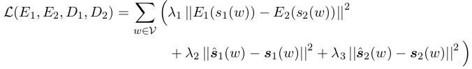

# Learning Word Meta-Embeddings by Autoencoding

论文地址: [http://aclweb.org/anthology/C18-1140](http://aclweb.org/anthology/C18-1140)

## 要点

本文的目的明确: 用自编码的方式来学习 WME, AE 的中间层状态来表示 WME. 为此, 文章提出了 3 种不同的 AE.

1. Decoupled Autoencoded Meta-Embedding \(DAEME\): 将不同 WE 编码后的结果拼接, 作为 WME, 解码时取对应的编码部分;
2. Concatenated Autoencoded Meta-Embedding \(CAEME\): 与 DAEME 的不同在于, 以整个 WME 作为解码的对象;
3. Averaged Autoencoded Meta-Embedding \(AAEME\): 将不同 WE 编码后的结果平均, 作为 WME.

与之前的 CONC, AVG 相比, 本文 WME 的表示没有特别之处, 只是多了一层编码的操作. 另一个区别是多了 loss, DAEME 的 loss 如下:

CAEME 与 AAEME 的 loss 相同, 如下:

本文的实验表明, 3 种 AEME 在效果上与 CONC/SVD/AVG 等接近, 时好时差, 一些情况下明显更好. 但是后者们简单得多, 实际使用更方便.

考虑到维数的影响, 文章对 AEME 们习得的结果进行了降维实验, 什么样的情况都有, 更好/更坏/基本不变.

