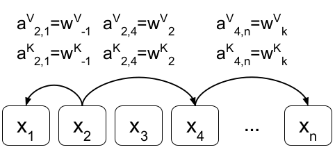

### [Self-Attention with Relative Position Representations](https://arxiv.org/abs/1803.02155)

#### TL;DR

本文可以说是 [Attention Is All You Need](https://arxiv.org/abs/1706.03762) 的姊妹篇. 不同于前一篇使用 *Positional Encoding* 将时序编码进序列, 本文将输入序列看成 a labeled, directed, full-connected graph. 然后学习*边*的表示, 作为*相对位置 relative position* 的表示. 实验发现, 在翻译任务上, 相比绝对位置, 即使用 positional encoding, 相对位置能带来性能提升.

#### Key Points

* Positional encoding 基于不同频率的正/余弦函数对位置进行编码, 对(绝对)位置进行编码的同时, 对于相对位置关系也具有一定的表示能力, 因为距离为 k 的两个位置的编码之间是线性关系
* 本文将输入序列视为带标签的, 有向, 全连接图, 学习边的表示, 显式地对相对位置进行编码, 并将边向量加入 self-attention 的计算过程, 使得 self-attention 对相对位置是可知的.
* 文中学习了两种不同的边向量, 分别在不同时候加入计算过程, 以下是边向量对 self-attention计算的改造:
    1. $z_i=\Sigma_{j=1}^n \alpha_{ij}(x_jW^V)$ $\rightarrow$ $z_i=\Sigma_{j=1}^n \alpha_{ij}(x_jW^V+a_{ij}^V)$ (按照文中的符号, 括号外的是阿尔法, 括号内的是小写的 A);
    2. $e_{ij}=\frac{(x_i W^Q)(x_j W^K)^T}{\sqrt{d_z}}$ $rightarrow$ $e_{ij}=\frac{(x_i W^Q)(x_j W^K +a_{ij}^K)^T}{\sqrt{d_z}}$ (此处是小写的 A).
* 两种 self-attention 的拓展都只是简单地加了边向量, 目的是不影响模型的计算并行性.
* 基于过长的相对位置并不能带来有用信息, 文中限制了两个位置的最大距离, 即边长. 如下, k 是最大边长长度:
    * $a_{ij}^K=w_{clip(j-i, k)^K}$;
    * $a_{ij}^V=w_{clip(j-i, k)^V}$;
    * $clip(x, k)=max(-k, min(k, x))$;
* 考虑到*空间复杂性 space complexity*, 本文在每个头之间, 序列之间都共享了相对位置表示 (只是扩展了 self-attention, 继续沿用 Transformer 的 Multi-head Attention).
~~* 对于后一种拓展, 不同位置对之间的相对位置表示不同, 无法通过单次矩阵乘法得到所有位置对的表示, 同时为避免相对位置表示的广播, 实际拆成了两部分进行计算: $e_{ij}=\frac{x_i W^Q(x_j W^K)^T + x_i W^Q(a_{ij}^K)^T}{\sqrt{d_z}}$. 前半部份就是为扩展时的 $e_{ij}$, 后半部分通过形变成能计算矩阵乘法的形状, 然后进行矩阵乘法, 最后将两部分将两部分相加.~~ (这部分内容, 我看不太明白)
* 文中实验发现
    * 同时使用 positional encoding 和相对位置表示并没有带来进一步的性能提升;
    * 边长大于等于 2 时, BLEU 已经趋于不变;
    * 使用第二种扩展, 即在计算对齐程度度时, 加入相对位置编码已经能足够了; (再使用第一种扩展并没有带来性能提升).
 

#### Notes/Questions

* 暂缺
