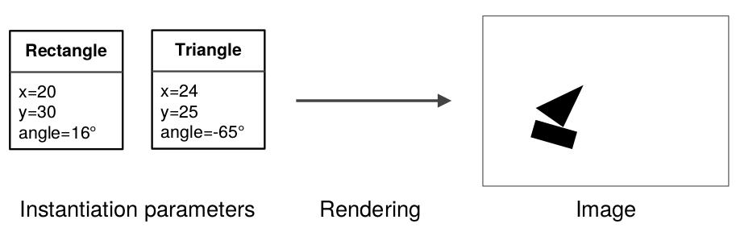
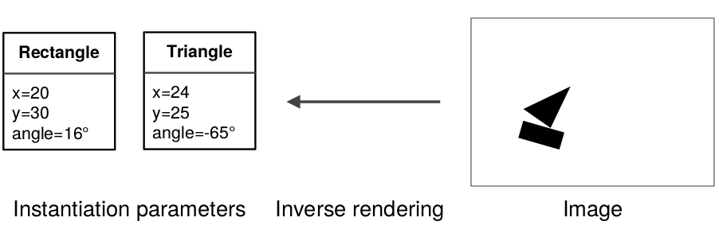

### [Transforming Auto-encoders](http://www.cs.toronto.edu/~hinton/absps/transauto6.pdf)

#### TL;DR

本文是 [CapsNet](https://arxiv.org/pdf/1710.09829.pdf) 的"前世", capsule 的基本哲学都出自本文. 本文从 CNN 的弊端出发, 引入计算机图形学 CG 中的**视点 viewpoint** 和**坐标系 coordinate frame** 的概念, 基于**不变性 invariance** 与**等变性 equivariance**, 提出了**胶囊 Capsule** 的概念, 为日后 CapsNet 的提出作了很长 (6年) 的铺垫.

#### Key Points

* 指出 CNN 的弊端: 多次**降采样 subsample** 之后, 高层特征对于自身的**姿态 pose** (总感觉而翻译不恰当, 后文将使用 pose, 读者自己体会) 将变得不确定 (比如鼻子的朝向), 从而使得计算精确的空间关系变得不可能.
* 提出胶囊的概念: 一组神经元. 与其用池化得到的**标量 scalar** 作为输出, 不如使用胶囊对输入进行相对更复杂的计算, 用向量来表示结果 (这个过程形象地称为**装入胶囊 encapsule**), 从而保留更多的信息.
* 胶囊将学习到场景中**可见实体 visual entity** 的特征, 并输出实体存在的概率, 和实体的**实例化参数 instantiation parameters** (对照文末的图, 将对何为实例化参数有更清晰的认识).
* 胶囊学得好的情况下, 可见实体在场景中出现的概率将是局部不变的, 即不管实体在局部空间如何移动, 它的存在性是**不变的 invariant**. 通俗地讲, 我望向你的脸~, 脸不会因为你的移动而消失.
* 实例化参数是**等变的 equivariant**. 因为实例化参数对应于实体的场景表示, 观察条件的改变 (比如角度) 或实体的移动, 实体的表示将改变. 比如你由正脸转成侧脸, 你高傲的鼻子的位置和形状就和之前不同了.
* 胶囊输出实例化参数的一大优势是, 使得通过识别部分进而识别得整体变得更加容易. 胶囊以向量形式习得的实体的 pose, 和 CG 中实体 pose 的自然表示是线性相关的. 此时, 两个激活的胶囊 A 和 B, 具有正确的空间关系, 从而激活高层胶囊 C 是很直观的. 通俗地讲, 识别到眼睛和鼻子, 它们的空间关系是正常人脸上的关系, 那么就相当于识别到脸了.
* 以上可以归纳为: 关于部分-整体关系的认知是**视点不变的 viewpoint-variant** (即不随观察点的变化而变化); 对于观察到的物体的实例化参数及其部分的认知是**视点等变的 viewpoint-equivariant** (即岁观察点的变化而变化). 前者用**权值矩阵 weights matrice**表示, 后者用**神经活动 neural activities** 表示. 具体地, 当脸转向了, 或者说观察点改变了, 表征眼睛或鼻子的胶囊 (里面是 vector) 乘以同一个矩阵 (坐标系转换), 将得到新的眼睛或鼻子的胶囊, 这是就表现脸视点不变性; 视点等变性上文已经提及, 至于神经活动, 就是胶囊中向量的改变.
* 本文中的胶囊由**识别单元 recognition unit** 和 **生成单元 generation unit** 构成. 识别单元作为隐层计算胶囊的输出向量, 其中特别有一位数字表示实体存在的概率 (这一点与日后的胶囊不一样); 生成单元则用于计算胶囊对高层胶囊的贡献 (CapsNet 中动态路由计算的就是这玩意儿).
* 胶囊的一个缺陷是, 一个胶囊只能表示实体的一种实例化参数.
* 下图是文中实验的所用的网络结构. 中间的圆角矩形就表示一个 Capsule. 其中下面的红色矩形代表识别单元, 上面的绿色矩形表示生成单元.

#### Notes/Questions

* 本文将 CG 的思想引入神经网络, 而且逻辑居然很通顺. 其实 Hinton 将其他领域的知识引入神经网络又不是第一次了. 这告诉我们, 知识是相同的, 有时候向内求解不得时, 可向外求解, 也许会有意想不到的收获.
* 笔者阅读时, 对于实验部分选择性浏览了一遍, 不得不说, 太晦涩了. 虽然道理讲得很清爽, 但实验部分真的不知所云啊.
* 笔者是在看了 CapsNet 的文章两篇之后, 才转而看这篇文章的. CapsNet 中许多没有讲清楚的概念, 都能在本文找到答案, 尤其是 CapsNet 的提出的哲学. 举个例子, CapsNet 中提到 **Inverse Graphic**, 没有 CG 背景的同学 (比如我) 会一头雾水. 有了本文的背景, 结合下图, 包秒懂.

