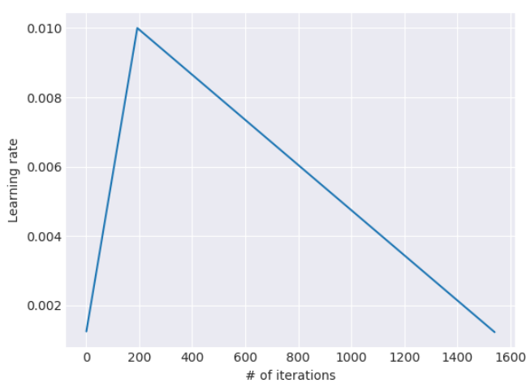

### Universal Language Model Fine-tuning for Text Classification

论文地址: [https://arxiv.org/abs/1801.06146](https://arxiv.org/abs/1801.06146)

##### TL;DR

本文的主要贡献是: 1) 提出了一种通用的 NLP 迁移方法, ULMFiT; 2) 提出了几种不同的调参方法.

##### Key Points

* 本文的出发点是: 是有效地进行 LM fine-tuning 的方法的欠缺阻碍了这项理念的发展 (和昨天的文章观点一致). 训练 LM 的问题在于, 在小的数据集上会过拟合, 对分类器进行调参会导致习得的语言特征灾难性地丢失. 在相似任务上的迁移, fine-tuning 的效果尚可, 但通常不适用于不太相关的任务.
* 为解决上述问题, 本文试图寻找一种通用的迁移方法. 同样使用的 language modeling. 本文给出了一些选择的依据:
    * LM 能 get 到下游任务中语言相关的点 (长期依赖, 层级关系, 情感等);
    * 可用的数据相比其他任务 (MT等), 多得多, 可以是任何领域, 任何语言的, 几乎没有限制;
    * LM 本身就是一些下游任务的组成部分 (如 MT).
* 作者要实现的"通用"包含以下几点:
    1. 可以迁移至不同文本大小, 不同数据量, 不同标签类型的任务上;
    2. 单一的架构和训练过程;
    3. 不需要特征工程或预处理;
    4. 不需要额外的领域内的文本或标签.
* ULMFiT 由几步组成:
    1. LM 预训练 (文章对此的描述是 general-domain), 学习比较通用的特征;
    2. 在目标任务上的 LM fine-tuning;
    3. 目标任务的 classifier fine-tuning.
* 以上第二步是前后两步的过渡, 为了弥补目标任务的数据分布与预训练的数据分布之间的差异. (昨天的方法是没有这一步的, 也是那篇文章强调的无缝对接的看点).
* 这一步的训练, 文章提出了几种行之有效的方法:
    1. discriminative fine-tuning: 具体而言, 就是为 LM 的每一层分配不同的学习率, 参数更新时, 各层按照各自的学习率进行更新. 此处作者提出了一个技巧, 先通过只调整最后一层的参数确定一个合适的学习率, 然后往前的每一层都使用后一层学习率的2.6分之一倍.
    2. slanted triangular learning rates (STLR): 该学习率的更新方法是为了实现快速收敛/调参, 学习率先快速增大, 后缓慢减小. 学习率的更新是线性的, 故呈现出斜三角的形状 (公式见 Notes)

* 在第三步中分类器的 fine-tuning, 文章在前两步习得的模型之上追加了两个线性层和输出层. (再对比着看, 可见昨天的方法的改动之少了)
* 考虑到文本分类任务上, 起关键作用的单词并不多. 文章以 LM 中最后一层 (RNN) 的最后的状态拼接上最大池化和平均池化, 作为追加层的输入.
* 这一步的 fine-tuning 是迁移学习成功与否的关键. 太过了, 会导致前两步习得的特征被灾难性地遗忘, 相当于前功尽弃; 太细致的调参, 算法将收敛地极慢.
* 针对以上问题, 文章提出了一种 gradual unfreezing 方法. 即一开始 fine-tuning 时, 冻结除最后一层外所有层的参数 (即设置参数不可更新), 然后逐步向前解冻.
* 迁移学习的一个优势是 low-shot learning, 即可应用于数据集较小具体任务. (因为之前在很大的语料上无监督学习过了) 实验证明, 在仅有 100 个训练样本的情况下, ULMFiT 最好的情况能和在 100 倍数据上训练的方法差不多.
* 最后, 实验证明了提出的几种 fine-tuning 策略都很有效.

##### Notes/Questions

* 我还是想不太明白为什么 discriminative fine-tuning 能带来性能提升. 是因为这样就允许更大的参数更新了? 假设使用同一个学习率, 反向传播到输入层时, 梯度消失得差不多了. 这是我想到的一个答案.
* 本文使用的缩写数量绝对是我见过最多的, 就像百年孤独中的人物名称一样. 所以缩写虽好, 也不能滥用.
* 以下便是公式化的 STLR. T 是预设的训练次数, cut_frac_是学习率增大过程的比例, 因此 cut 就是临界点, p 是关于增大或减小学习率的迭代次数的分数, ratio 是最大 LR 和最小 LR 的差值.

