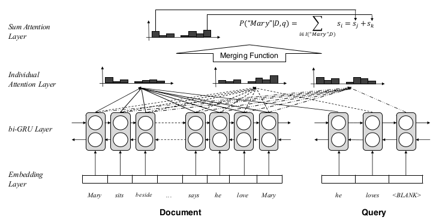

# Consensus Attention-based Neural Networks for Chinese Reading Comprehension

论文地址: [https://arxiv.org/abs/1607.02250](https://arxiv.org/abs/1607.02250)

## TL;DR

本文在 ASReader 上做了微创新, 对 query 中每个单词对应的 attention 做一个 merging, 得到最终的 document 中各单词作为 answer 的概率.

## Key Points

* 文章公开了一份中文阅读理解数据集. 数据集构造方法如下 \(欲自建数据集的同学可了解下\):
  * 以人民日报的文章为语料, 分词+词性标注;
  * 给定一篇文章, 随机选择一个名词作为 answer \(要求至少出现 2 次以上\);
  * 以包含 answer 的句子作为 query, 并将 answer 挖掉;
* 文章还构造了额外两个测试集, 以童话为语料, 而不是新闻, 这就更考验模型的性能了. 其中一个仍按上述方法构造, 另一个是手工构造的, 后者使得机器阅读的难度更大了.
* 文章提出了 Consensus Attention Sum Reader, CASReader. 可以看出是基于 ASReader 的.
* 还是简述下模型结构:
  * Document 与 query 共享 embedding, 好处是相比分离地学习两套 embedding, query 能获得更好的表示 \(没见过两套 embedding 的\);
  * 两套 Bi-GRU, 分别计算 document 和 query 的表示, 前向和反向 hidden state 做拼接处理;
  * 对 query 中的每个单词, 计算它与 document 中所有单词的匹配程度: $\alpha\(t\)=softmax\(h_{doc}\bigodot h_{query}\(t\)\)$ \(t 表示时序, 即 query 的第 t 个位置\).
* \(敲黑板\). 所谓 consensus, 是要在 query 的每个单词上达到某种共识; 所谓 consensus attention, 就是在单词对应的 attention 之间取得共识: $s=f\(\alpha\(1\), \dots, \alpha\(m\)\)$ \(m 表示 query 的长度\).
* 文中提出了三种 merging function f:
  * max \(此时的共识就是推举出最大的 attention, 下面的类似\): $s\propto softmax\(max\_{t=1\dots m}\alpha\(t\)\)$;
  * sum: $s\propto softmax\(\Sigma\_{t=1}^m \alpha\(t\)\)$;
  * avg: $s\propto softmax\(\frac{1}{m}\Sigma\_{t=1}^m \alpha\(t\)\)$;
* 最后, 和 ASReader 一样, 对 document 中 unique word, 计算所有位置上的概率和: $P\(w\|D, Q\)=\Sigma\_{i\in I\(w, D\)s\_i,w \in V}$ \($I\(w, D\)$ 是指示函数, 表明单词 w 出现在 D 的位置\).
* 文中对于 unknown words 的处理 mark 一下. 将 200K 的 vocab 砍到 100K, 所有的 unknown words 映射到不同的 10 个符号, 而不是  就完了. 该方法出自另一篇论文, 余以为 10 个符号的含义可以自由发挥, 不必拘泥.

## Notes/Questions

* 文中说, 以他们的方法构造数据集, document 可复用, 即 document: \(query, answer\) 是 1:N 的关系, 从而能构造大型数据集 \(之前的方法, 一种是使用自动生成的摘要作为 query, 一种是以 document 的后一句作为 query\). 不过, 我感觉这样得到的数据集质量会很差, query+answer 都不能保证能推理吧.

