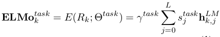

# Deep contextualized word representations

论文地址: [https://arxiv.org/abs/1802.05365](https://arxiv.org/abs/1802.05365)

## TL;DR

本文提出了一种词向量的监督学习方法: 构建双向语言模型\(biLM\), 训练之后, 用其中间状态的函数来表示词向量. 简称 EMLo, 目前 SOTA 的词向量.

## Key Points

* 学习好的词表示存在两大挑战:
  1. 对单词使用的复杂特征进行建模 \(比如句法和语义\);
  2. 单词在不同上下文的使用是变化的 \(即一词多义\).
* 最常使用 CBOW, Skip-gram, GloVe 等方法, 将单词视作基本单元, 只能学到每个单词的一个上下文无关的表示, 只能捕捉单词的句法和语义特征; 近来的研究开始关注到上下文依赖的词表示, 开始学习 contextual embedding.
* 为解决上述问题, 文章在大型语料上训练了一个双向语言模型 \(biLM\), 用嵌入层的向量和双向 LSTM 的隐藏状态的函数作为最终的词向量. 高层的 LSTM 状态能捕捉词义的上下文依赖信息了; 低层的向量则能对句法进行建模, 学到上下文无关特征.
* EMLo 模型由 embedding layer 与 L 层 bi-LSTM 组成, 它的状态可以表示为:  \(x 即为 embedding layer 的输出向量\).
* 最终, 将 EMLo 的各层状态向量压缩为一个向量:  \(其中 $\gamma$ 与 s 分别起控制缩放与权值的作用, 取值根据下游任务来. 可以认为在下游任务确定之前, EMLo 并不导出词向量, 就保持了多层状态向量\)
* 文中指出一点: biLM 不同层的激活值可能会有不同的分布, 可采用 Layer Normlaition. \(这在 Attention is All You Need 和 Distance Self-Attention Network 中都使用过\)
* 将 ELMo 用于下游任务时, 文中提供的思路是, 直接在 biLM 之上新增神经网络层, 固定 biLM 的参数 \(根据实际情况, 继续 fine-tune 应该也没问题\). 后续层的输入, 根据任务的不同, 调整为 $\[x\_k, ELMo\_k^{task}\]$ 或 $\[h\_k, ELMo\_k^{task}\]$.
* 适当地使用 dropout 和 regularization 对于 ELMo 的效果更好.
* 文章进行性能评估的方法可以借鉴一下: 大多数论文的实验只给出指标的得分\(比如 F1 得分\), 本文的结果会多一栏性能提升的百分比, 更直观一些.
* 实验的对照组选择了同样是监督学习得到的词向量, 但它们仅仅使用了模型输出层的向量作为词向量. ELMo 带来更大的性能提升证明了不同层能习得不同信息的表示.
* 由于 ELMo 的词向量是不同层状态向量的函数, 对 attention-based model, 相当于后续层可以接触到 biLM 的内部表示; 综合了不同层的表示, ELMo 的词向量还具有消除歧义的作用.
* 有一点很惊艳的是, ELMo 能相当大程度地提高训练效率: 在其中一项实验中, 不使用 ELMo 的模型在 486 个 epochs 后取得达到最大 F1 值; 使用 ELMo 只用了 10 个 epochs.

## Notes/Questions

* 实验很详细, 模型的描述也比较清晰, 但关于 biLM 的训练, 即使在补充材料中也少有提及, 连用的什么语料似乎也没有提及 \(或者我没注意\). 留下了无限的想象空间, 读者请随意.
* 在 word2vec 系的无监督学习方法盛行的时代, 用监督学习的方法来学习词向量有耳目一新的感觉. 在很久很久\(10年\)以前, 词向量的学习向来是其他 NLP 任务的副产品; 随着 C&W 模型的问世以及 word2vec 的名声大噪, 普遍做法是将词向量的学习单独拎出来, 预训练得到的词向量用于下游任务时, 一般还是需要 fine-tune; 现在, 一些模型开始使用类似原来的监督学习的方法来学习词向量, 只是词向量的学习成了主要任务.

