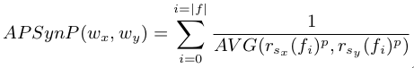

### A Rank-Based Similarity Metric for Word Embeddings

论文地址: [http://www.aclweb.org/anthology/P18-2088](http://www.aclweb.org/anthology/P18-2088)

##### 要点

在 NLP 领域, 通常用 cosine similarity 来度量两个词向量之间的相似性. 最近我在思考怎么就没有其他方法了呢? 本文提供了一种思路.

新的方法很多都是出于解决旧方法的历史遗留问题, 让我们先看看 cosine similarity 有什么问题. 使用 cosine similarity 时, 词向量每一维的贡献是平等的, 而问题就在于, 这不应该是平等的. 一个显然的例子是 distributional word embeddings, 对 counting-based word embeddings 进行压缩 (比如 SVD) 得到的 word embeddings, 此时一个词向量可能就包含了于它许多不重要的信息. 计算相似度时, 如果能屏蔽掉无关紧要的特征, 而充分利用真正重要的特征, 将会大大提高对单词间相似度的估计. 本文正是基于此观点, 提出了一种 rank-based 方法.

文章用上述公式来计算单词间的相似度. N 表示基于 top N 个特征来计算相似度, s_x 和 s_y 是按特征值降序排序过的词向量, r() 是一个索引函数, 找到特征 fi 的排名, 然后对该特征在两个词向量中的排名求平均再求倒数, 最后求和, 完毕. 其实该函数是作者们在另一篇论文中提出来解决 counting-based word embeddings 的问题的 (这也是为什么式中 i 的上限是 N), 它的一个问题是, 特征权重 (Sigma 求和的值) 会随排名急剧下降, 如下图蓝色曲线所示.

对于 counting-based word embeddings 不是什么问题的原因是, 它的一个向量太大了, 几千几万个小的值加起来也不容小觑. 而一般 prediction-based word embeddings 的维度不会很大, 能下到的预训练好的常常最多 300 维, 不足以解决相似度被排名最靠前的特征统治的问题. 为解决该问题, 只需要一个小小的指数标记:

唯一的改变是, 对特征的排名先应用指数函数, 再求平均求平均求倒数求和. 这里作者悄悄把 i 的上限改成了|f|, 意思就是说, 这是给 prediction-based word embeddings 用的.

本文的第一个实验, 对比了 APSyn/APSynP 和 cosine similarity 在 word similarity 上的表现, 时好时坏, 没有明显的优势.

不过在第二个实验"outlier detection"上, APSynP 完胜. 任务是, 从 n+1 个词中, 找出不属于这个类的那个词, 可以认为在玩"谁是卧底游戏". 文章提出的方法在此任务上的优越性比较好理解. 同类之间具有更多的相似性, 它们的词向量的排名会比较接近, 异常词则会有更明显不一样的排名, 就被揪出来了. 就像谁是卧底里, 互相对口供 (对特征), 说着说着, 卧底就暴露了.

##### 备注

Yoshua Bengio 2010 年的论文对 distributional word embeddings 和 distributed word embeddings 作了区分. 后者才是我们所熟知的用神经网络学到的 word embeddings, 比如 CBOW. (https://www.aclweb.org/anthology/P10-1040)
