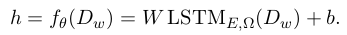
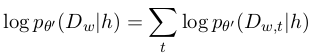
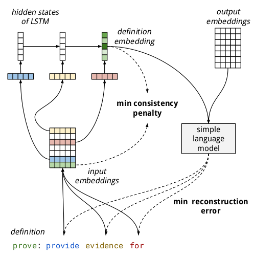

# Auto-Encoding Dictionary Definitions into Consistent Word Embeddings

论文地址: [http://www.aclweb.org/anthology/D18-1181](http://www.aclweb.org/anthology/D18-1181)

## 要点

之前的一篇论文介绍了区分 similarity 和 relatedness 的必要性. 很多论文就改进 word embeddings, 或提升某一方面的能力, 提出了一些 post-process 方法. 本文方法, 简而言之是用 autoencoder 来学习单词的定义, 如题目所示, 他们希望得到更一致的 word embeddings.

中外的词典, 对单词的定义一般都是"单词:一段描述/解释". 本文的出发点就是, 一个好的 word embedding, 应该是它的含义的浓缩, 也就是说, 我们能够从一个单词的 word embedding 中生成得到它的定义.

本文的方法很直观, 用 autoencoder, 输入单词的定义, 根据文章的说法, 得到_definition embedding_, 它需要和原 word embedding 比较一番, 然后将 definition embedding 输入 decoder, 重构定义. 从以上描述中, 我们可以清晰地看到两个训练目标:

1. 保持 definition embedding 与 word embedding 的一致 \(min consistency penalty\);
2. 重构 definition, \(min reconstruction error\).

模型方面, encoder 用了 LSTM, 最后一个 hidden state 的线性变换作为 definition embedding, 如下\(Dw是单词w的定义, 是一个序列, E, $\Omega$分别是input embedding matrix和LSTM的参数\).

Decoder 是一个 language model, 以 definition embedidng 为\(条件\)输入, 得到的序列即为重构的定义. 不过文中只使用了线性映射作为 language model, 他们发现 LSTM 反而不好, 可能是字典数据太小, 过拟合了. Autoencoder 的训练目标是最大化 definition embedding 与生成的定义的对数似然, 不计较词序\(其实看成是以被定义单词为 target word, 重构的定义为 context 的 skip-gram\):

如上所述, 除了减小重构误差, 模型的另一个目标是保持 definition embedding 与原 word embedding 的一致, 目标函数如下. d 是一个距离函数, 文中使用了欧式距离\(Euclidean Distance\).

其实, 保持 definition embedding 与 word embedding 的一致的初衷是为了解决定义的递归问题, 即定义中的单词有它自己的定义, 在它的定义里的单词又有其定义. 它带来的另一点好处是, 可以使用 pre-trained word embedding 来进一步得到更好的 definition embedding. 模型的全貌则如下所示:

除了训练 word embedding 或 post-precess pre-trained word embedidng, 该模型的 encoder 和 decoder 还单独拎出来用: 使用 encoder, 可以新兴的词汇, 根据其定义生成较准确的 embedding; 对有 embedding 但无定义的单词, 还能使用 decoder 生成其定义\(但单词量巨大的时候, 这不失为一种有效的方法\).

