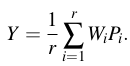

### Linear Ensembles of Word Embedding Models

论文地址: [http://www.aclweb.org/anthology/W17-0212](http://www.aclweb.org/anthology/W17-0212)

##### 要点

我觉得本文可以归类到 word meta-embedding, 因为都是基于多个预训练好的 word embeddings 来生成一个更好的 word embedding, 但是作者说: 不, 我们不一样.  有点牵强的两个区别:

1. 本文的 word embeddings 是使用同一个算法, 在同一个语料上训练得到的;
2. 本文的一大贡献是: 做了正交性限制.

从第一点来看, 本文的初衷就像是通过降噪(不同word embeddings之间随机性误差)的方式来提升 word representations, 而算法在语料上捕获的有用的信息就沉淀下来了.

本文的大致思路可以用以下三个公式来概括:

最小化 target word embedding (Y) 与预训练的 word embeddings 的线性转换(WP) 的欧式距离;

用 WP 的均值来更新 Y;

以上是一个无限循环的过程, 用下式来控制结束, 当它小于阈值, 就停止.

文章的重点在于如何求取线性转换矩阵 P, 提供了两种思路:

1. 由于 Y=PW 用*普通最小二乘法(Ordinary Least Squares, OLS)*可以得到解析解, 作者首先就用了该方法: $P=(W^{T} W)^{-1} W^{T} Y$. 该方法的问题在于, Y 和 WP 可能会趋向于 0, 从而导致无效解. 作者的解决办法是, 每个循环, 先对 Y 进行缩放(rescale), 使每一列的方法等于 1;
2. 第二种方法将问题看作一个 Orthogonal Procrustes 问题, 有正交性限制, 要求 $PP^{T}=P^{T}P=I$. 该方法同样有解析解, 过程比 OLS 要复杂, 具体如下:

1. 首先计算: $S=W^{T}Y$;
2. 使用 SVD 进行对角化: $S^{T}S=VD_{S}V^{T}$, $SS^{T}=UD_{S}U^{T}$;
3. 最后 $P=UV^{T}$.

方法 2 的好处在于, 正交性限制保留了 WP 中向量的模与向量间的角度, 也不用担心收敛到 0.

实验显示, 方法 2 得到的 word embedding 各方面都好得多, 就不一一描述了.

##### 备注

我们已经知道使用集成方法(ensemble method)时, 模型的差异越明显, 互补性就越强. 本文的启示是, 就 word embeddings (或其他类似问题), 正交性限制的重要性.
