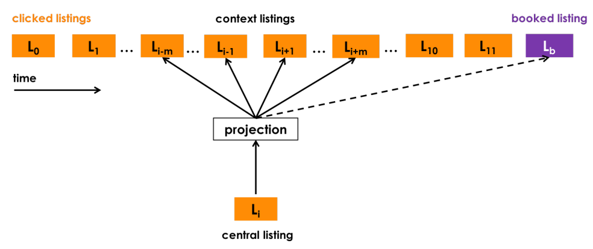

### Real-time Personalization using Embeddings for Search Ranking at Airbnb

论文地址: [https://dl.acm.org/authorize.cfm?key=N665520](https://dl.acm.org/authorize.cfm?key=N665520)

##### 要点

本文是 KDD2018 的最佳论文, 写得真好呀! 它提供了工业界将技术落地的一个视角, 披露了 Airbnb 的技术细节, 我个人有一种千金买骨的感觉.

简而言之, 本文将 embedding 技术应用到了搜索排名中, 借向量间的 cosine similairity 来提高检索质量, 提供更精准的检索, 即提高买家(guests)更可能下单(book)的商品(house)的排名 (买家少花时间). 值得一提的是, 如题目所示, 这个个性化的过程是实时进行的.

为实现实时个性化推荐, 文章主要对 3 样东西进行了 embedding:

1. listing embedding (简单地说, 一条搜索结果/一个商品就是 a listing);
2. listing type embedding (根据 listing 的属性, Airbnb 对它们有分类);
3. user type embedding (同上);

简单的套用 embedding 是不可能拿最佳论文的, 文章针对 Airbnb 自家服务进行了很多细节的调整, 以下一一进行说明.

listing embedding 的模型如下图所示, 借了 skip-gram 模型的壳. 和 word2vec 学习 word embedding 不同, 此处将用户的点击会话(click session)作为一段"文本", clicked listing 作为 token, listing 的集合则充当了 vocabularity. 其他如目标函数, negative sampling 等都被沿用了.

以下是 Airbnb 针对具体业务对模型的调整:

1. 有两类会话, 一类以下单结束, 一类仅浏览. 对于前者, **成交的商品(booked listing, 上图中的紫色矩形) 作为 global context, 被加入到每个 clicked listing 的 context window 中**, 也就是说, skip-gram 不仅要预测时间轴上靠近的 clicked listing, 而且每次都要预测 booked listing;
2. Airbnb 的商品是 house, 有市场(城市/区域)之分, 如无意外, 用户会限制搜索的地域, 这使得一个会话中的 context clicked listing 具有相同的市场, 而 negative samples 由于随机采样, 哪个市场的 listing 都有, 这个 imbalance 会损害 within-similarities, 于是他们**补充了从 target listing 所在市场采样的 negative samplies**;
3. 考虑到每天都会有新的 listing 上传, Airbnb 采用了**冷启动的方法来学习新的 listing embedding**. 具体来说就是, 根据卖家(house hosts)提供的房子的信息, 找到地理位置与其最近的, 同类型的, 属于同一价格区间的 3 个 listing, 求 mean vector 作为新的 listing embedding;

出于几方面的考虑, 就不一一列举了, Airbnb 对 user-type 而不是 user-id 进行了 embedding. listing embedding 上面已经介绍了, 此外还学了 listing-type embedding. 依然使用 skip-gram, 不过"文本"换成了 booking session, 即成交的会话. 相对于 click session, booking session 在数量上少得多(这是用 user type 的原因之一), 它收集的是多个用户的数据, 按时间顺序排列; token 则是 user-type 和 listing-type, 即成交的双方(买家和商品)的类型. Airbnb 特意将 user-type 和 listing-type 嵌入到同一向量空间, 这样就能度量两者之间的相似度, 为个性化推荐提供了一个参考量.

Listing-type 基于规则得到, 其实就是商品的不同信息(价格区间, 房间大小, 城市等)的组合; user-type 也基于类似的机制.

Listing-type 和 user-type embedding 的模型如下所示, 很简单地将属于同一个订单的 user-type 和 listing-type 组合在一起, 然后将所有的(user-tpe, listing-type)按时间顺序排列. 图中所示 target token 是一个 user-type, 其实也可以是 listing-type, 此时可以将它们看作是一样的.

Airbnb 对该模型的修改在于, 考虑到卖家有权拒绝交易, 不管出于什么原因, 商品和买家之间就是不匹配了, 而这样的推荐只会带来同样拒绝的结果. 于是他们对卖家拒接交易的情况也进行了采样, 当 user-type 或 listing-type 存在不匹配的情况, 失败交易的另一方被加入当前的 negative samples 中(图中所示 $Ut_i$ 被拒绝过, 于是这场交易的 listing-type 作为 negative sample 加了进来(红色矩形)).

在使用 embeddings 技术之前, Airbnb 已经有一个在用的个性化推荐系统, 主要考虑了 4 类特征: listing features, user features, query features, cross-features. 前两类很好理解, query feautres 就是当前的搜索需求相关的特征, cross-features 则是前三者中的两两之间或三者间的交叉特征. 而以上学到的 listing embedding, user-type embedding, listing-type-embedding, 它们之间的 similarities 作为补充的 embedding features, 提供了对实时个性化的支持. 这得益于它们保留的用户的历史数据 user short-term history, 包括两周内点击过的 listing, 点击并停留超过 60 s 的 listing, 跳过的推荐 listing, 过去两周内的成交等等.

根据文章的说法, listing embedding 提供了短期实时个性化支持, 而 user-type 和 listing-type embedding 提供长期个性化支持. 对于前者, 这真・该用户的数据计算得到的特征, 而且时间被限制在 2 周之内, 所以被称为短期, 而实时是因为, 这些特征是用户执行搜索时生成的; 对于后者, user 和 listing 都向上抽象了一层, 和前面的关系像气候与天气的关系, 它一旦形成, 作用时间会更长, 范围会更广, 更难以突变, 这是我理解的长期的意思.

对本文提出的技术, Airbnb 分别进行了线下实验(用现有的数据), 还进行了线上的 A/B 测试. 线下定性与定量的实验都证明了 embedding 技术的有效性, 比如相似的 listings 具有更高的 cosine similarity; 而线上的 A/B 测试证明加入新技术之后, 推荐质量提高了.

##### 备注

对比 Airbnb 对搜索技术的研究与国内某度的搜索服务, 有一种高下立判的感觉(仅代表个人观点). 不是说谁的搜索技术更牛, 两家提供了是不同性质的搜索, 没有直接的可比性. 作为用户, 搜索是为了找到需要的内容; 作为服务提供商, 应以提供精准的搜索为目标. 套用张小龙的话, 搜索应该是工具, 用完即走. Airbnb 的搜索服务于自己的业务, 目的是为了让用户尽快找到满意的住所, 提供高质量的搜索服务, 对于买家(guests), 卖家(hosts), 平台都有利, 是三赢的局面. 而某度是一个互联网搜索引擎, 它的搜索范围是整个互联网, 但它的目的却不在于提供精准的搜索, 而是基于互联网的广告搜索+百家号号内搜索, 它越是为自身谋利益, 用户就越难从它的搜索结果中找到自己需要的内容, 用户利益的损害就越大.
