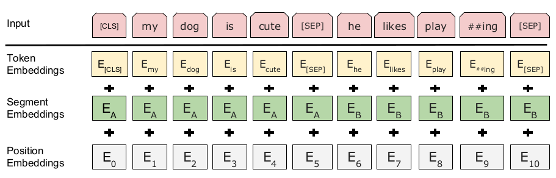

### BERT: Pre-training of Deep Bidirectional Transformers for Language Understanding

论文地址: [https://arxiv.org/abs/1810.04805](https://arxiv.org/abs/1810.04805)

##### 要点

> 我发现我忘记写 BERT 的笔记了.

对 BERT 影响最大的要数早它半年问世的 ELMo 和 OpenAI GPT 了, 不止在正文中対标了这两者, 甚至在摘要中就指名道姓了. 颇有国内手机厂商互掐的风范.

BERT 是 Bidirectional Encoder Representations from Transformers 的缩写, 三要素分别是 bidirectional, encoder representation, transformer; 也可以理解成两个要素: bidirectional encoder, transformer. 模型方面, 和 ELMo 相比, 主要的差别在于 transformer (对于 bidirection 的使用也不一样); 和 GPT 相比, 主要差别则在于 bidirectional. 此外, BERT 应用了一套完全不一样的训练方法.

本文把将预训练模型应用于 downstream tasks 分为两类:

1. feature-based: 此类方法将预训练的表示作为 additional features, 模型方面可能不使用预训练的模型, ELMo 被归到了这一类, 按照定义, word embeddings 也属于此类, 只是 ELMo 更"高级";
2. fine-tuning: 此类方法用的就是预训练的模型, 当然具体到特定任务可能会增删改局部结构, 大体上的思路是对模型的参数进行微调.

在我看来哦, 两者的区别并不那么明显, 就像人们使用 word embeddings, 也会更新 embedding layer. 而 MT-DNN, 就是基于 BERT 的, BERT 提供了特征, 其实也作为模型的一部分跟着训练.

BERT, GPT, ELMo 的模型如下所示:

抽象到这个程度, BERT 完全如其名所示, 只是 multi-layer bidirectional Transformer encoder. 对比 BERT 和 ELMo, ELMo 的双向操作是常规的 Bi-RNN 的操作, forward 和 backword 泾渭分明, 只会将特征传给自己人; 而 BERT 是基于 Transformer 的, 可以说没有 forward 和 backword 的说法 (图中 Transformer 之间没有横向连接), 每个时序位置上的输出都传给了后一层所有的 Transfomers. 这算 bidirectional 吗? 相对 GPT 只有时序上从前往后传算是吧. 从模型示意图中, 我们看到 BERT 相对于 GPT 也只有这一点不同, 有 Bi-RNN 的珠玉在前, OpenAI 的研究员们怎么不多往前走一步呢?

细节上, BERT 使用 [CLS] 这一特殊 token 作为序列的开始, 在后面大有用处, 比如执行文本分类时, 就是以它对应的输出作为序列的表示, 这一传统也被 MT-DNN 沿用了. 和 GPT 类似, BERT 也用了一个分隔符 [SEP] 将两个序列合并成一个序列, 从而将 textual entailment 和 semantic textual similarity 任务转化为文本分类问题 (GPT 只对前一类任务这样做了). 不过 BERT 还为两个序列赋了不同的 embedding, 称为 segment embedding, 所以它的模型输入是 3 项的和: word(token) embedding + position encoding + segment embedding. 如下所示: (显然如果只是一个序列的情况, 只是用一个 segment embedding 即可; 要是丧心病狂到多个序列的合并, 估计得用多个 segment embedding 才行)

预训练方式上, BERT 采用了 multitask learning, 有两个任务:

1. *完形填空* (官方说法叫 Masked Language Modeling, MLM): 没错, 就是英语考试阅读理解前面的那道题, 不过 BERT 更惨, 候选项是整个 vocab. 随机地挖掉一些词(15% 的概率), 让 BERT 来预测被挖掉的词. 使用第三个特殊 token [MASK] 表示空位, 不过考虑到 [MASK] 其实只在预训练阶段用到了, 对 fine-tuning 不友好, 文章 80% 的情况下替换单词为 [MASK], 10% 替换为一个随机单词, 另外 10% 保持单词不变. 注意, MLM 已经不是正常意义上的 language modeling 了, 它不是依次预测下一个单词, 而是*遇"空"预测*, 这个空位的输入可能是 [MASK], 可能是随机单词, 可能是原单词, 而目标则是原单词. 根据文章的说法, 只有 1.5% 的情况是随机替换, 所以不会损害模型的语言理解能力; 相对于正常的 LM, 现在只有 15% 的预测, 需要更长的训练时间才能收敛;
2. 下一句预测: 可以看成是高一级的 language modeling, 不再根据单词来预测单词, 而是上升到了句子的层面, 充分挖掘句子层面的关系信息. 训练上没有太复杂, 就是用 [SEP] 将前后两句拼接起来, 将问题转为二分类问题: 后一句是否是前一句的正确的下一句.

至此, 预训练就讲完了. Fine-tuning 的话, 看下面这张图吧. 图 a, b 分别适用于句子对(两个句子)和一个文本的情况; 图 d 是一一映射的情况, 适用于 NER, POS Tagging 等任务; 图 c 比较特别一点, 适用于从内容中找答案的 QA 任务 (至少图中所示的方式不适用于开放式任务), 也就是图中的 SQuAD, 对 paragraph 的每一位输出, 都计算它属于答案的概率.

##### 备注

文章对比 BERT 与 GPT 讲到一点, GPT 在 800M 单词的语料上进行预训练; 而且 BERT 是 2500M + 800M. 我曾经怀疑数据量激增是 BERT 优于 GPT 的一个原因. 最近 GPT-2 在更大的语料 40G, 800M 文档的语料(WebText)上进行训练, 结果又反过来碾压 BERT 了. 如果 BERT 在 WebText 上训练, 又是怎样的光景呢?

