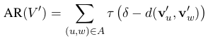
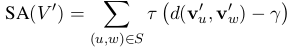

### Counter-fitting Word Vectors to Linguistic Constraints

论文地址: [http://www.aclweb.org/anthology/N16-1018](http://www.aclweb.org/anthology/N16-1018)

##### 要点

与 Retrofitting 类似, 本文旨在利用*同义*与*反义*关系来提升单词间的语义相似度.

为此, 文章分别维护了一个反义词集和一个同义词集, 并将目标函数拆成了 3 部分的组合:

1. 异性相斥: 这完全借用了物理学的描述, 让反义词在距离上相互远离, 目标函数如下(u, w 互为反义词, d 是距离函数 1-cos, \delta 是 margin, 表示理想的最小距离, \tau=(0, x));

2. 同义相吸: 与上相反, 要使互为同义词的单词相互靠近, 目标函数如下(\gamma 是理想的最大距离);

3. 原向量空间的保持: 顾名思义, 这一项的目标就是尽可能地保留单词的原始语义, 对学好的词向量抱有很大的信赖, 不希望严重破坏它的语义, 目标函数如下;

最终的目标函数就是以上三部分的加权平均.

##### 备注

本文的初衷之一是提升对话系统的*dialogue state tracking(DST)*能力, 即理解用户的意思并更新系统的 belief state, 从而更好地为用户服务, 避免答非所问的情况.

文章将异性相斥的 \delta 设为 1, 对应于词向量正交的情况. 这一点我持怀疑态度, 为什么反义关系反应在向量上就是正交?
