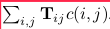
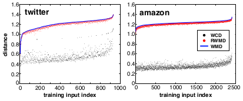

### From Word Embeddings To Document Distances

论文地址: [http://proceedings.mlr.press/v37/kusnerb15.pdf](http://proceedings.mlr.press/v37/kusnerb15.pdf)

##### 要点

本文的初衷在于: BoW 或 TF-IDF 等方法在度量文档相似度时, 仅考虑了句子层面的语义, 却没有考虑到单个单词的作用. 举个例子, 以下两个句子, 在去掉停词之后, 就没有重叠单词了, 但是它们却具有相似的语义. (直观上, 各单词词频不一样, TF-IDF 不适用; 鉴于单词相似性, BoW 可能受用, 也很可能不, 取决于组合方式和词向量的性能.)

1. Obama speaks to the media in Illinois.
2. The president greets the press in Chicago.

随着 word embeddings 习得的 representations 越来越好, 再受到 Earth Mover's Distance 的启发, 本文提出了名为 Word Mover's Distance(WMD) 的方法来度量文档相似性. 简而言之, 本文的想法是: 文档间的距离(不相似度)可以表示为一个文档的单词(embeded)全部转换成另一个文档中的单词所需的最小移动距离. 思想上与通过增删改最少字母来表示单词距离的 [Levenshtein distance](https://en.wikipedia.org/wiki/Levenshtein_distance) 等方法有些相似, 只是 WMD 累计的不再是修改字母的次数.

WMD 具体是这样的: 使用一个 nxd 的 embedding matrix (d 是词量的维数, n 是词汇表的大小), 那么一个文档可以表示成一个 n 维的向量, 每一维上用文档中的词频(小数)来表示, 文章称为 nBOW. 为了加入单词间的相似度, 文章将 c(i,j) 表示为两个单词的转移代价, 可以是欧式距离或 cosine similarity. 显然, 语义越相近的单词间的转移代价越小(比如例句中的 Illinois 和 Chicago). 然后使用两个文档的 nBOW, 记为 d 和 d', 构造一个 nxn 的矩阵 T, T 的每个元素都表征一个单词到另一个单词的转移量, 可见 T 的某一行或列表征了一个单词从一个文档转移到另一个单词文档中所有单词的量(0元素不考虑在内). 因此, WMD 可以表示为: , 一个文档中所有单词转换成另一个文档中所有单词的转移代价(移动量x代价).

**对转移量有如下限制, 即到文档中某一单词的转移量等于该单词在文档中的词频.**

WMD 的示意图如下(图中的数值已经是转移代价). 上半图展示了在剔除停词等之后, 3 个句子含有相同数量单词的情况, 只画出了单词到另一个文档中最邻近单词的箭头, 属于理想情况. 下半图展示了更普遍的情况, 即文档单词数不相等, D0 的 nBOW 表示, 每个单词对应的值都是 0.25, 而 D1 的则为 0.33.

WMD 的计算量为 $O(p^3log(p))$, p 是两个文档包含的单词总数, 需要极大的计算量. 因此文章提出了两个更快的近似替代法:

1. Word Centroid Distance(WCD): 将文档表示为词向量的加权平均, 计算量是 $O(dp)$
2. Relaxed RWMD(RWMD): 即放宽了以上两条限制中的一条. 为了得到 WMD 更紧的下界, 文章采用了分别取消一条限制得到两个相似度, 取其大者. 计算量 $O(p^2)$.

为了进一步减小计算量, 文章使用了 Prefetch and prune 的算法: 对需要排序的文档, 根据其与查询文档的 WCD 进行升序排序, 并计算前 k 个文档的 WMD. 然后将剩余的文档反转, 即从 WCD 值最小的文档开始, 检查 RWMD 下界是否超过了当前第 k 相近的文档, 是则剪掉它, 否则计算它的 WMD 并更新 top k 最相似的文档列表. 由于 RWMD 能得到非常紧的下界, 对于一些数据集, 该算法能剪掉 95% 的不相似文档.

下图是在一个数据集上计算的文档间的 WCD, RWMD, WMD. 可见, WCD 真的是一个非常非常松的下界, 而 RWMD 则是一个非常紧的下界.

