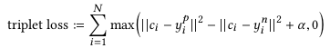

# Improving Word Embedding Compositionality using Lexicographic Definitions

论文地址: [URL](https://github.com/iamkissg/PaperHighlights/tree/e748838bc232093f9685c22210ec5bff856cf116/2019/02/URL/README.md)

## 要点

从题目, 我们了解到本文的目的在于借单词的定义来提高 compositionality.

那么什么是 compositionality 呢? 基于 word's context 来学习 word representation, 使得 word vector 同时捕获了语义\(semantics\)与语法\(syntax\). 语法信息对 composition 有用, 但无益于单词单独使用的情况. Composition 就是对多个单词的词向量加工处理, 得到一个能表征词组含义的 representation. Bag-of-Words 是最常使用的模型之一. Compositionality 就是词组被"压缩"处理之后, 还能准确表意的能力.

文章提出并对比了多种方法:

1. Algebraic composition: 即用代数运算来生成最终的 word representation, 包括向量加, 向量乘, 每一维的最大特征和平均特征 \(normalization 会造成信息丢失\);
2. 边 composing 边调整 embeddings: 说来也简单, 就是以  为目标函数, 缩小定义中的词与被定义词的距离, 同时增大它与随机单词间的距离. 欧式距离可以换成 cosine similarity;
3. Learning to compose: 训练模型, 包括单层神经网络, RNN, CNN 等. 即使是简单的单层神经网络, 也避免了原生向量空间的限制, 从而充分发挥词向量的 compositionality. 不过文中的单层神经网络是对方法1中线性组合过的向量的操作, 后面再接一个 tanh 层. RNN/CNN 都是常规操作, RNN 使用了 GRU, CNN 使用了不同的 window size.

为了检验 compositionality, 文章特地构造了一个测试集. 大体是对 composed representation 搜索最邻近的单词们, 排序, 查看正确单词的排名. 此处文章用了一个 ball tree algorithm. 根据作者的说法, 基于排序的评估更合适, 因为它不依赖于向量空间, 而且对排序可以使用不同的指标, 从而提供不同角度的观察. 事实上, 本文就用了多种指标, 包括: Mean Reciprocal Rank, Mean Average Precision, Mean Precision@10, Mean Normalized Rank.

记下结论:

1. fasttext 的训练就采用了向量加的方法\(n-gram 的相加\), 所以天然从向量加中受益;
2. 向量乘差极了;

