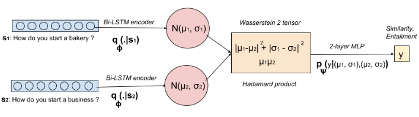

### Learning semantic similarity in a continuous space

论文地址: [https://papers.nips.cc/paper/7377-learning-semantic-similarity-in-a-continuous-space](https://papers.nips.cc/paper/7377-learning-semantic-similarity-in-a-continuous-space)

##### 要点

本文的思想清奇: 将文档表示成一个正态分布! 于是, 文档间的不相似度就变成了从一个分布迁移到另一个分布的量. 该(不)相似度的指标类似于 WMD, 只是 WMD 考虑的是从一个文档的单词迁移到另一个文档的单词的迁移量的累计和. 如果将 WMD 的迁移看作是*离散的*, 那么本文提出的方法从分布迁移到另一个分布的方法/指标就是*连续的*, 文题由此而来.

文章提出了两步走的学习方法:

1. 学习一个深度生成模型(VAE), 用于将句子表示成正态分布;
2. (在第一步的学习完成之后, )用 Siamese Framework, 比较两个句子的正态分布表示, 而非向量表示.

下图是将句子表示成分布表示的示意图.

通过 VAE(变分自编码器) 来得到句子的正态分布表示, 此时句子不再被表示成向量空间中的一个点, 而是由均值$\mu$和方差$\sigma$构成的后验分布. 这样做的好处是, 分布的不确定性意味着它表征了句子所有可能性句意/意图的可能性. 模型示意图如下所示. 用了一个单层的 BiLSTM 网络作为 encoder layer, 用 BiLSTM 的输出(以什么为输出比较自由, 可简单地实验得到, 最大值/均值/最后一个时间步的hidden state)构造正态分布的均值与方差: 均值由简单的线性变换得到, 同时线性变换得到对角协方差矩阵的对数表示. Decoding 阶段, 采用 teacher-forcing, decoder 以正确的句子作为标准输出.

图中的 N(0,1) 表示使用了reparameterization 的技巧: $z~\mu(s)+\sigma(s)N(0,1)$. Repeat 和 Reformulate 则分别意味着, 图中的 s' 可以是输入(repeat), 也可以是另一个相同意思的句子(reformulate).

至于用 Siamese network 来比较两个句子得到的 distribution represetation, 和以向量为输入的模型无太大差别, 只是必须要考虑到分布表示由两个变量刻画得到. 模型示意图如下. 图中已经很明确地标出了如何计算 wasserstein2 tensor, 并以此作为 MLP 的输入, 最后输出句子对的相似度.

