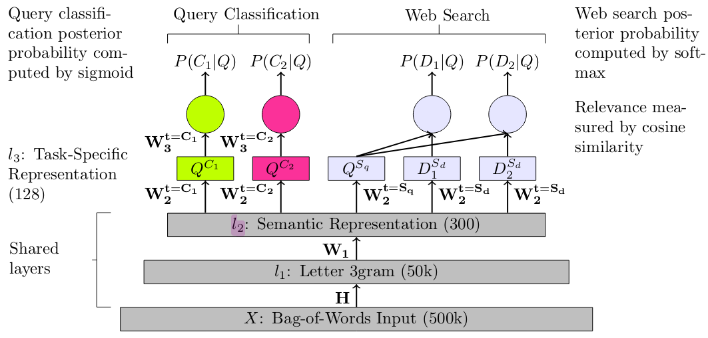
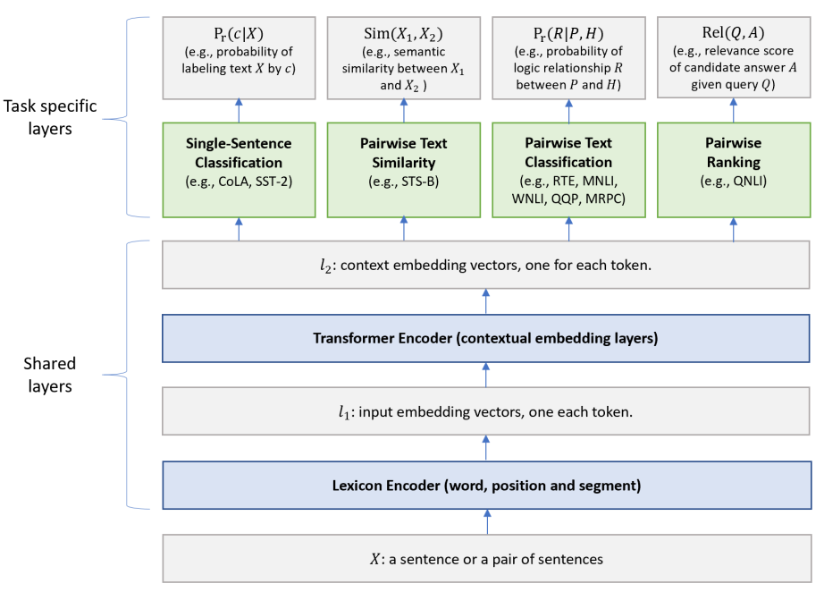

### Multi-Task Deep Neural Networks for Natural Language Understanding

论文地址: [https://arxiv.org/pdf/1901.11504.pdf](https://arxiv.org/pdf/1901.11504.pdf)

##### 要点

牛顿爵爷说过: 如果说我看得比别人更远些, 那是因为我站在巨人的肩膀上. 这个道理似乎放之四海皆准, 至少站在"最强"的模型之上, 你的模型可能就成最强的模型了. 本文就是这样的一个例子.

文中提出的 MT-DNN 是作者 15 年提出的多任务学习模型的一个扩展, 最主要的改动就是使用 BERT 来学习句子(句子对)的表示. 前后模型的对比如下两图所示.

可以看到框架基本不变, 模型都由两部分组成: Shared layers 和 Task specific layers. 前者负责学习输入句子或句子对的通用表示, 后者提供了多任务学习的支持. 除了使用了更现代化一些的 Lexicon Encoder 替换了 Letter 3gram, 模型方面其他的改动几乎都是应 BERT 的使用而变的, 甚至都不得不说 Lexicon Encoder 的使用, 一方面也是为了 BERT.

BERT 本身就是为迁移学习而生的, 但是它一次只能针对单一任务进行 fine-tuning, 本文提出的 MT-DNN 则可以同时在多个任务上进行 fine-tuning. GPT-2 的论文抛出了一个疑点"在单一领域的数据集上进行单一任务的(监督)训练限制了模型的泛化", 并试图采用无监督 language modeling 习的方式来解决. 本文则采用了另一种思路: 利用多任务间的约束来避免单一任务上的过拟合, 从而提升模型的泛化能力. 直觉上比较好想通, 在一个任务上表现出色的模型在其他任务上可能会失效, 在多种任务上都表现良好的模型, 一方面已经证明了它的多面能力, 另一方面, 它在新任务上失效的可能性大大降低了(脑海中突然冒出一个词, task-ensemble, 各位看看就好).

根据文章的说法, 多任务学习的另一个(我没想到的)优势是, 比起单任务, 它能提供更多的数据. 数据量是监督学习不容忽视的一个量.

上文说到 Lexicon Encoder 的使用某种程度上也是为了 BERT. 事实上, 它就是 BERT 的一部分, 上图2中 Lexicon Encoder + Transformer Encoder = BERT, 文章用了"拿来主义", 直接使用的 Google 预训练好的 BERT. 后面 Task specific layer 的输入, 也完全按照 BERT 论文来 (以 [CLS] 对应的输出作为句子/句子对的表示). 于是本文就省了预训练的步骤, 直接在 GLUE 上进行 fine-tuning.

GPT-2 狂揽 7/8 项 language modelding 任务的记录. 本文的模型则连破 8/9 项 GLUE 任务的记录, 剩下 1 项还是因为数据集本身有问题. MT-DNN 与 BERT-large(在单一任务上分别 fine-tune) 的对比如下(省略表头).

MT-DNN 的 shared layers 就是 BERT-large, 因此可以认为它的优势完全来自于多任务学习. 多任务学习带来的另一个优点是, Domain Adaptation(领域自适应能力), 只需要少量数据, MT-DNN 就能在新任务上取得较好的结果, 在数据极端少的情况下(新任务数据集0.1%的数据), 准确率较 BERT 高了近一倍(80+% vs. 50+%).
