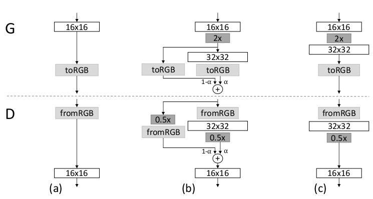

# Progressive Growing of GANs for Improved Quality, Stability, and Variation

论文地址: [https://arxiv.org/pdf/1710.10196.pdf](https://arxiv.org/pdf/1710.10196.pdf)

## 要点

如果没记错, 本文是最早的高清GAN. 它的想法比较朴实, 既然一开始就生成高分辨率图像很难\(原因生成的图像太假, 得到的梯度不好用\), 那就从低分辨率图像开始, 慢慢地往高清走. 具体的做法就是慢慢地增加 generator 和 discriminator 的神经网络层数, 而且两者是同步变化的. 在整个训练过程中, G 和 D 的所有层都是可训练的, 不存在 frozen 的情况. 示意图如下.

在增大分辨率的时候, 文章采用了平滑过度的方式, 示意图如下. 和 LAPGAN 很像, 不过我忘了哪一部分称为残差了.

