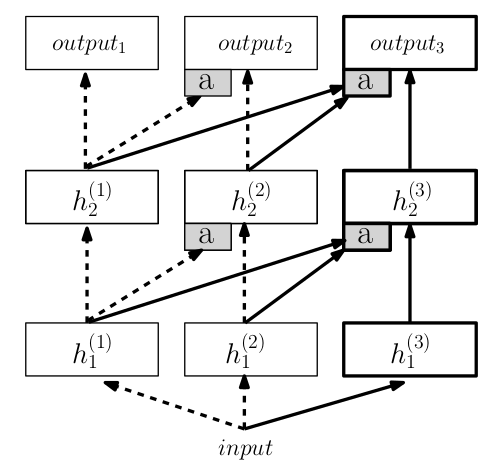

### Progressive Neural Networks

论文地址: [https://arxiv.org/pdf/1606.04671.pdf](https://arxiv.org/pdf/1606.04671.pdf)

##### 要点

本文旨在解决迁移学习的一个问题: 遗忘, 或者说灾难性遗忘(catastrophic forgettting) -- 普通迁移学习用在其他任务上预训练好的模型作为初始模型, 因为有先验知识, 能快速收敛至较好的结果, 但是随着 fine-tuning, 先验知识慢慢地被更新, 就面目全非了.

本文的方法方法很简单粗暴: 维护一个模型池, 每遇到一个新的任务, 就新建一个模型, 之前的模型则提供先验知识(补充的特征), 但不再更新. 模型示意图如下所示. 图中的一列就代表在一个任务上新建并训练的模型, 当前已经有了两个训练好的模型, 在第三个任务的训练上, 前两个模型对应层的特征作为第三个模型每一层的补充特征, 提供先验知识, 挺像 RNN 的吧, 这样的连接被称为 lateral connections(自个儿翻译的: 侧向连接). a 是一个 adapter layer, 调整来自其他模型的补充特征.

由于维护着一个模型池, progressive network 的弊端也很明显, 模型池的参数量将随着任务数成线性增长. 对此的解决思路是: 剪枝或模型压缩.
