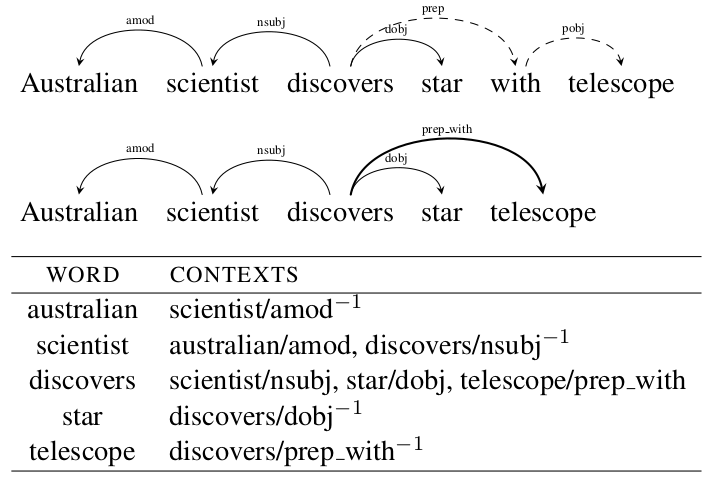

# Dependency-Based Word Embeddings

论文地址: [https://www.aclweb.org/anthology/P/P14/P14-2050.pdf](https://www.aclweb.org/anthology/P/P14/P14-2050.pdf)

## 要点

* Skip-gram 的改版, 替换了 context words 的采集策略.
* 原生 Sip-gram 将近邻单词不加区分的作为 contex words, 强调了 topical similarity.
* 本文先对语料中的每个句子进行 dependency parsing, 得到 dependency parse-tree, 根据上下文的句法来选择 context words \(syntactic contexts\), 将更多地强调 functional similarity.
* 由 dependecy parse-tree 得到 context words 的示意图如下. \(我对 dependency parse 不熟, 所以文章的这部分一些表述我看不太明白, 不过示意图很清晰了, 最上面的是原始 dependency parse-tree, 第二幅图则是对介词做了处理的结果\)

* Dependency-based context 有两个明显的优点:
  1. 距离近但无关的单词不再作为 context words, 有点降噪的意思;
  2. 更远的, 不再 window size 范围内的, 只要相关, 也可以作为 context words \(上图中的 discovers 和 telescope\).
* 实验验证了以上猜想, dependency-based word embeddings 能更好地捕获 functional similarity, 而普通 skip-gram 更善于捕获 domain similarity.

