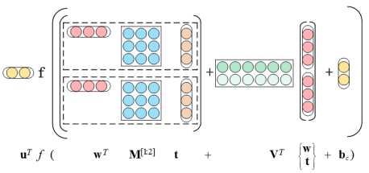
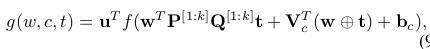

# Learning Context-Sensitive Word Embeddings with Neural Tensor Skip-Gram Model

论文地址: [https://www.ijcai.org/Proceedings/15/Papers/185.pdf](https://www.ijcai.org/Proceedings/15/Papers/185.pdf)

## 要点

一词多义, 或者单词的意思应该随上下文而定, 学者们老早就意识到了, 本文就提供了一种思路. 如题所示, 本文旨在赋予 word embeddings 上下文的感知能力, 借助了 Neural Tensor 这样一个特殊的网络结构.

具体来说, 作者区分了不同 topic 下同一个 word 的不同含义 \(从现在的角度来看, 算比较粗躁的\), 比如苹果, 可以是水果, 也可以是科技公司. 先假定水果就是一个 topic, 有对应的 topic embedding, 那么作为水果的苹果的含义, 就来自两部分: word embedding 和 topic embedding. 从这种角度来看, topic 有点像一个开关, 打到那, word embedding 就流到哪, 并被赋予上对应的特征. 文章称这时候的 embedding 为 context-sentitive word embedding \(topical word embedding\).

文章扩展了 Skip-gram, topic embeddings 直接先有 LDA 算法获得, 后面再更着模型训练更新. 用 neural tensor 的结构来融合 word embedding 和 topic embedding \(这个结构零星地看到过几次, 有些地方叫 neural tensor network, NTN\), 如下所示:

公式已经包含在上图中了, 参数包括: u, w, M, V, b. M, V 和 b 是上下文相关的, 不过为了减少参数量, 文章将 M 改成了上下文不相关的. 为了更进一步减少计算量, 文章对 M 进行了分解 tensor factorization, 最终的公式如下:

这里其实有一丢丢绕, V 和 b 与其是说上下文相关的, 不如直接说就是 contex word 对应的参数, 相应的, negative samples 也有它们的 Vs 和 bs. 因为还是采用的 Skip-gram 的范式, 上式会得到一个标量, 对它进行 sigmoid 就能训练了

