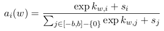

# Not All Contexts Are Created Equal Better Word Representations with Variable Attention

论文地址: [http://aclweb.org/anthology/D15-1161](http://aclweb.org/anthology/D15-1161)

## 要点

本文和另一篇论文取了相似的题目, 但研究内容完全不同. 本文的主要观点是, 一个单词的上下文中, 一些单词与目标单词有强相关性, 另一些则不. 于是就利用了这一发现, 对 CBOW 进行了改造.

具体来说, 就是用 attnetion 来计算不同位置的上下文单词的权重, 用加权平均代替普通平均来计算上下文的表示. Attention 是基于相对位置来计算的, 如下公式所示:

k 是针对单词 w 的相对位置 i 的, 而s 就仅仅和相对位置有关了. 示意图则如下 \(颜色越深, 相关性越强\):

实验表明, Attention CBOW 在 syntactic 任务 \(POS Induction\) 上有明显帮助.

