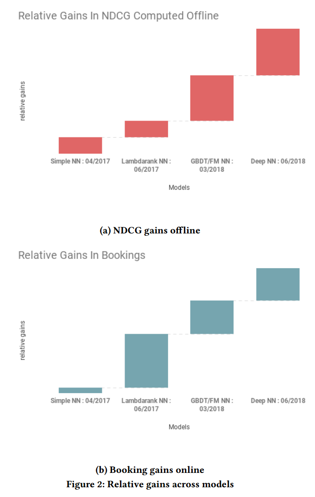
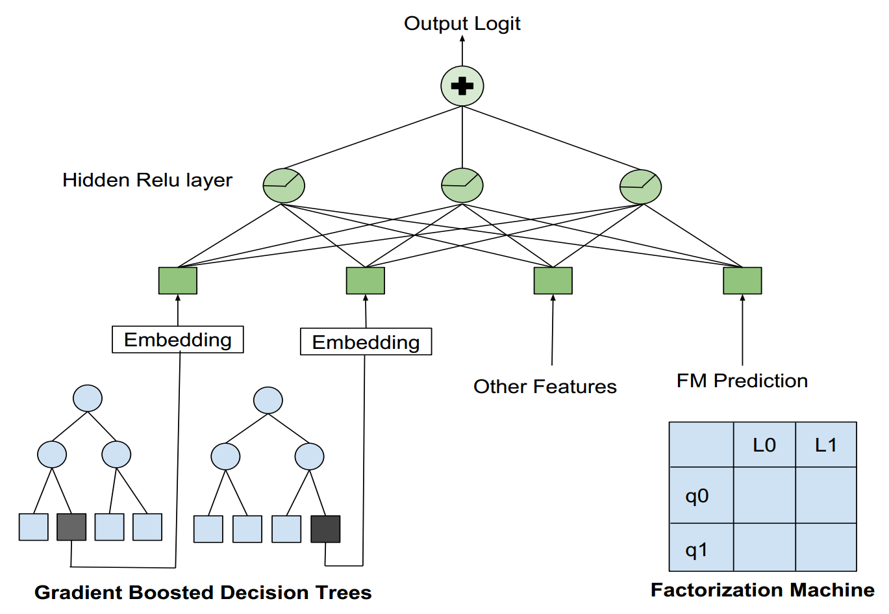
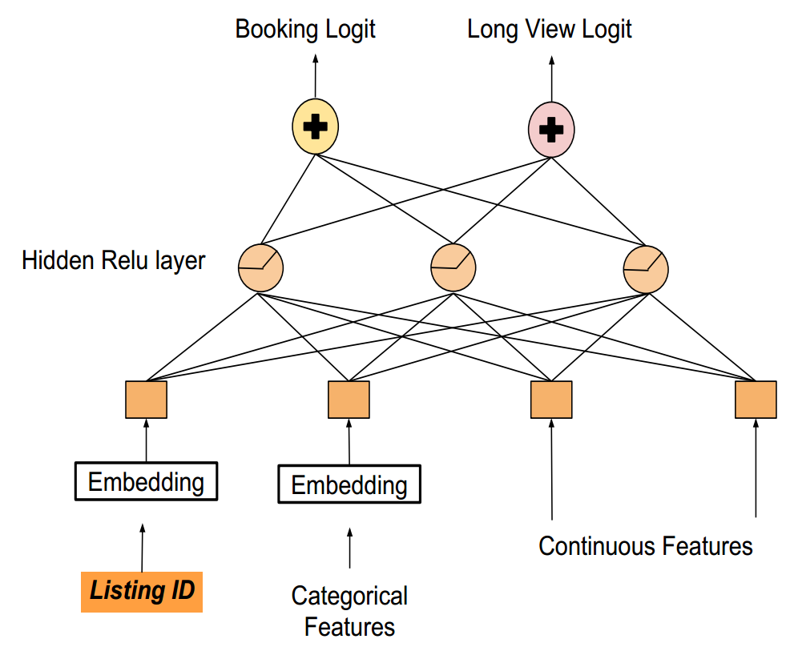
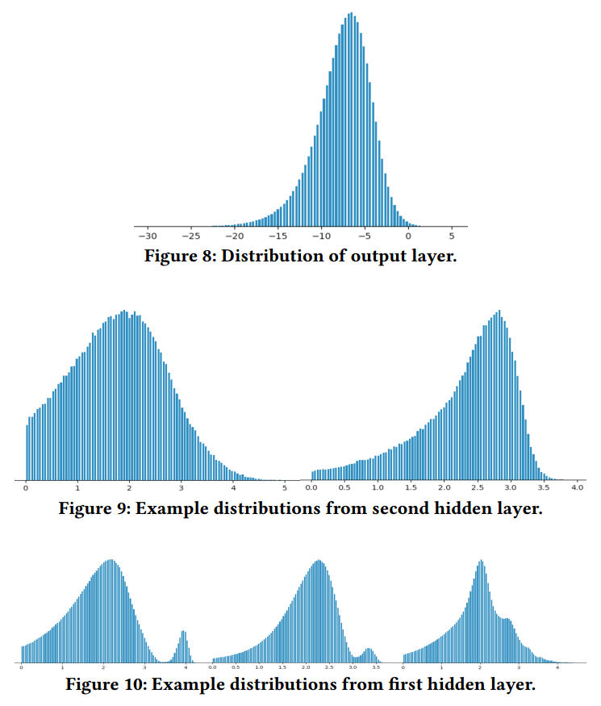
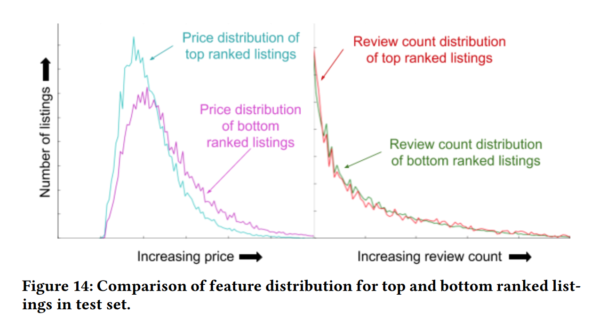
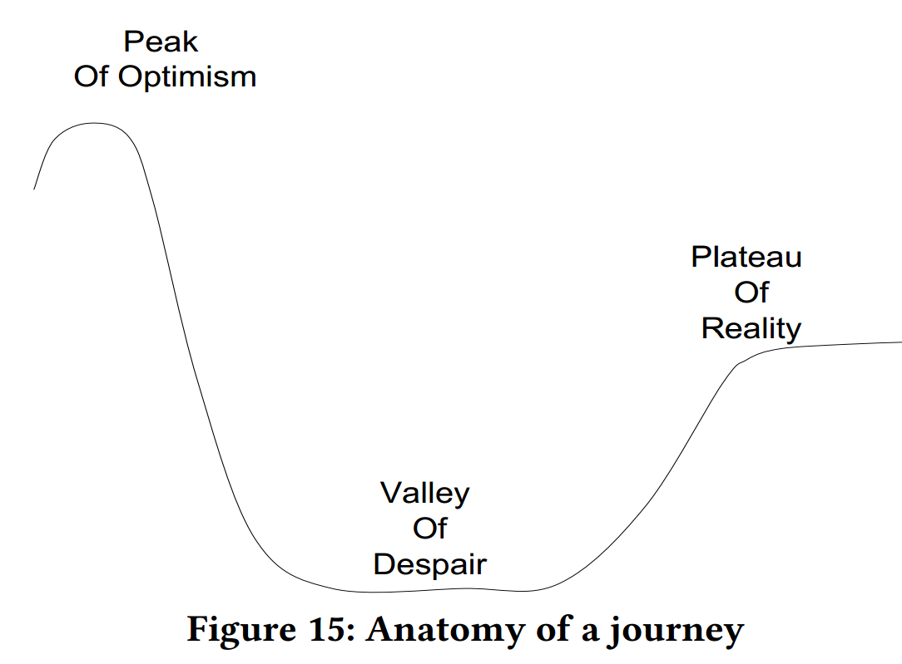
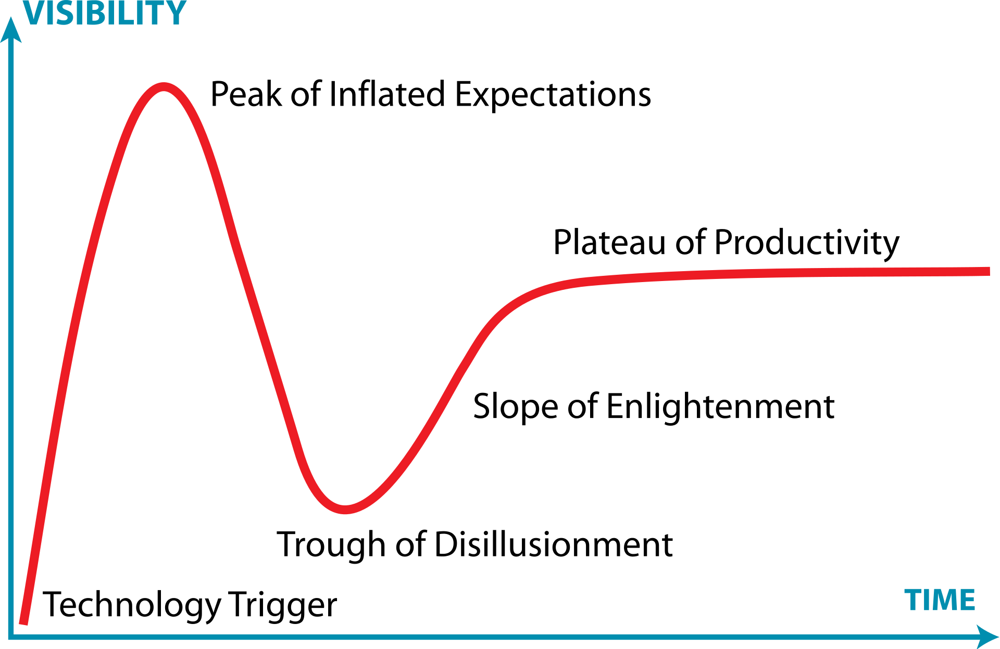

# Applying Deep Learning To Airbnb Search

论文地址: [https://dl.acm.org/doi/10.1145/3292500.3330658](https://dl.acm.org/doi/10.1145/3292500.3330658)

本文是 Airbnb 被 KDD 2019 录用的论文，非常详细地记录了他们将深度学习引入搜索排名（Search Ranking）的探索过程，写得相当好，字字珠玑，干货满满。

在拿了 KDD 2018 的最佳论文之后，这一次，他们想必是冲着 KDD 2019 的最佳论文来的。只是可惜了。

好玉不雕。在这篇笔记中，我将按照原文的顺序，尽可能原原本本地记录本文的重要内容。（笔记挺长的，4800+字，建议收藏阅读。这也证明了论文确实是好论文，真・字字珠玑。）

首先需要注意的是，本文的讨论仅限于**搜索排名模型**。这个模型是 Airbnb 整个模型生态中的一环，其作用是根据房客（Guest）预订的可能性，对房源（listing，参考官方的翻译）进行排序。

## 模型的演化

在尝试深度模型之前，他们使用 GBDT（Gradient Boosted Decision Tree）做搜索排名。

按照他们的说法，将模型迁移到深度模型并非一蹴而就的，而是一系列迭代优化的最终结果。截止 18 年 6 月，主要有四个阶段性的成果，模型性能的提升如下所示。

### Simple NN

Andrej Karpathy（特斯拉的AI主管）曾经发表过关于深度模型结构的看法：Don't be a hero。不要（妄想）成为一个英雄。大意是劝人不要一开始就上复杂的模型。

不听老人言，吃亏在眼前。Airbnb 的众人不听劝，上来就搞了一个相当复杂的模型，结果被其复杂性所压垮，最后不了了之。

不再妄想成为一个英雄，Airbnb 的深度学习之旅才正式拉开了序幕。

他们回过头来从一个简单的单隐层神经网络入手。这个 NN 只有 32 个神经元，直接使用了原来 GBDT 的输入特征作为输入。

上线之后，NN 的性能与 GBDT 的相当。这说明 NN 是有效的，能够服务于他们的真实流量。因此，他们有了继续探索的动力和勇气。

### Lambdarank NN

简单的神经网络并没有带他们走得很远。在实践中，他们对 Karpathy 的建议有了新的认识：don't be a here, in the beginning。不要在一开始就想做大英雄。隐含的意思是，英雄还是要当的，不过要慢慢来。

第二次进化的契机是，引入了 Lambdarank 的思想[^1]。这使得他们能够直接针对 NDCG（Normalized Discounted Cumulative Gain，一个线下评价指标）进行模型优化，从而同时提高了模型在线下和线上的性能。

引入 Lmabdarank 思想，对简单神经网络的主要改进有二：

1. 将数据整理成`{预订的房源，展示但没预订的房源}`的形式，采用 pairwise 的训练方式代替了原来 pointwise 的方式；
2. 对 pairwise loss 进行加权。具体地，交换构成训练数据的两个房源在搜索排名中的位置，根据交换引起的 NDCG 的差异来设置加权系数。按照文章的说法，这还有助于提高预订的房源在搜索结果中的排名。

### Decision Tree/Factorization Machine NN

NN 逐渐成为了 Airbnb 提供搜索排名的主要模型。不过依然有其他的模型在研，其中最值得关注的两个分别是：GBDT 和 FM（Fatorization Machine）。这些模型在测试集上的性能与 NN 具有可比性，但是它们给出的搜索排名与 NN 的差异巨大。

受混合模型的启发，他们将 FM 输出的最终预测作为 NN 的一项输入，并将 GBDT 中每棵决策树中最终被激活的叶节点的索引视为类别特征输入 NN，构造了一个搜索排名的混合模型。模型结构如下所示。

## Deep NN

Airbnb 的简单神经网络经过 3 次进化之后，在2018年6月，终于脱胎成了深度神经网络。说它深，其实也不深，只是从单隐层变成了双隐层。

一个典型的模型设置是：

1. 195 维的输入层，这还是算上类别特征嵌入的 embedding size 的结果；
2. 127 维 + 83 维的隐藏层，使用 ReLU 作为激活函数；
3. 输入的特征多是房源的基本特征，如价格、历史预订数等。

在这里，作者们多提了一句，说，DNN 在 CV 等领域取得了人类水平的性能，但是“我们”并不清楚自己现在处于什么位置。这个问题的部分原因是，在搜索排名或者推荐系统中，难以定义人类的水平。

> 借着作者开的话头，我也来多说几句。
>
> 我是研究 NLP 的，在我的认知中，NLP 的研究是落后于 CV 的。2018 年，预训练语言模型爆火，Sebastian Ruder 将之称为 “NLP's ImageNet moment”[^2]。如果按 ImageNet 诞生的 2009 年算起，NLP 落后 CV 9年；如果按 AlexNet 横空出世的 2012 年算起，NLP 落后 CV 6 年。
>
> NLP 落后 CV 的一个重要原因是：CV 处理的对象以及评价标准，相对更加客观。相比之下，NLP 受限于人的主观感受，对于一个任务，很难给出客观的评价标准，比如如何评价“主观”和“客观”？这样的莫衷一是，加上语言本身的模糊性，使得 NLP 比 CV 更“难”一些。
>
> 从处理对象的复杂性来看，假设 CV 处理的图片和视频是简单对象，NLP 处理的语言文字是复杂对象，那么，搜索排名或者推荐系统处理对象——人，就是超级复杂的对象。尽管一千个人有一千个哈姆雷特，但是语言文字一旦说出口写下来，它作为客观存在的那部分就固定了。人，却无时无刻不在变化之中。
>
> 我甚至怀疑，Resys's ImageNet moment 会不会到来。

## 失败的模型

看上面的四个例子，似乎 Airbnb 对深度学习的探索，只是在起步的时候走了弯路，后面就顺风顺水了。其实不然。

正所谓，一将功成万骨枯。每一个成功的模型背后，都是数不清的失败的尝试。文中举了两个失败的案例。

### Listing ID

在这个例子中，他们尝试使用房源 ID 来学习房源嵌入，就像词嵌入一样。但是在尝试过各种方法之后，发现房源嵌入总会导致过拟合，以致于不可用。

公认有用的 Embedding 技术，为什么不适用了？对此，Airbnb 的思考是：Embedding，需要一个 item 出现的次数足够多，才能收敛到一个合理有效的值，反之则不行。比如词嵌入对于生僻词的表示就是欠佳的。反观房源，最火爆的房源一年的预订数也不过 365 次，一般的房源的预订数就更加远远不如了。这使得每个房源 ID，都像是生僻词，难以学到高质量的房源嵌入。

### Multi-Task Learning

观察到“房源详情页的浏览时长与预订之间具有相关性”，他们提出了同时预测预订概率和浏览时长的多任务学习方式，模型结构如下所示。

可以看到，在这个模型中，他们依然使用了房源 ID 嵌入的方式。实际上，使用多任务学习框架的目的之一就是为了处理房源 ID 过拟合的问题。

线上测试的结果表明，该模型确实大幅提高了房源详情的浏览时长，但是并没有改善预订率。于是，他们对长浏览低预订的房源进行了人工检查，找到了以下几点可能导致长浏览的原因：

1. 推荐了高端高价的房源；
2. 推荐了描述很长的房源；
3. 推荐了一些特别的，甚至是搞笑的房源。

> 幸福的家庭都是相似的，不幸的家庭各有各的不幸。——《安娜·卡列尼娜》
>
> 套用在这里的话，失败的模型各有各的原因。像 Airbnb 这样，去挖掘失败背后的原因，去深刻地理解失败。在我看来就特别好，可能是自己尚缺这样的能力吧。
>
> 失败和成功，到底谁才是成功之母？有说失败的，也有说成功的。就失败而言，如果不能从中吸取教训，失败就不是好的失败，失败是失败之母。

## 特征工程

在 NN 之前，Airbnb 使用 GBDT 做搜索排名，并且有很多年的特征工程经验。NN 的特征自动化很有吸引力，但是他们并没有放弃特征工程，因为他们发现，输入处理过的数据而不是原始数据能让 NN 的计算效率更高，性能可能也更强。

需要注意的是，他们理解中的面向 NN 的特征工程，不同于传统的特征工程，不在于使用数学推导出某种特征，而是**确保特征具有某些特性，使得 NN 本身能够进行高效地数学计算**。

### Feature Normalization

一开始，他们将 GBDT 的输入特征不做任何修改地输入 NN。结果非常糟糕。

对于决策树而言，只要数值特征的相对顺序有意义就行，它们确切的值反而不重要。NN 则对特征的数值很敏感。比如，异常值在反向传播时会带来很大的梯度。对于像 ReLU 这样的激活函数，由于梯度消失问题，可能会因此永久地被关停。

对此，他们希望通过特征工程，确保所有的特征都被限制在一个小范围内：分布中的大多数值落在`{-1, 1}`的区间内，分布的中位数为 0。具体地，

- 对于特征分布类似正态分布的，使用$\frac{val-\mu}{\sigma}$做归一化，其中$\mu$和$\sigma$分别是特征均值和标准差
- 对于特征分布类似幂律分布的，使用$log(\frac{1+val}{1+median})$做归一化

### Feature Distribution

除了将特征限制在一个小范围内，他们还希望通过特征工程，确保特征具有平滑的分布。这主要有以下三方面的原因。

第一，分布的平滑性能用于识别 bug。这是因为，错误的分布通常不是典型的分布（正态分布、幂律分布等）。

第二，平滑的分布能增强模型的泛化能力。DNN 的泛化能力为什么这么强，一直是学界研究的一个热点。对此，Airbnb 也有自己的发现与思考。他们通过绘制 DNN 每一层输出的分布（如下所示），发现这些分布在逐层变得更加平滑。

据此，他们给出了对 DNN 泛化能力的一个解释：当特征很多时，特征值的组合空间几乎无限大，而训练只能覆盖到一部分的特征组合。此时，低层输出的平滑分布确保了高层能够为未见过的数据正确地插值。

第三，分布的平滑性能用于检查特征的完整性。

对此，他们举了一个遇到的实例。房源的*未来可预订天数*是房源质量的一个强信号，因为高质量的房源倾向于提前售完。但是他们发现房源的占用分布是不平滑的。进一步调研发现了影响房源占用的另一个因素：最少住宿天数，而这一因素依赖于日历，根据预订的可能性是动态变化的。于是，他们补充了*房源的平均住宿时长*作为特征。

### High Cardinality Categorical Features

尽管房源 ID 容易导致过拟合，Airbnb 发现其他的高基数[^3]特征确实能够提升 NN 的性能。更重要的是，与 GBDT 不同，将高基数特征用于 NN，几乎不需要特征工程。NN 能够自动地学习此类特征的 embedding。

此处，他们举了将*城市的社区*作为高基数特征的例子。通过可视化，可以看到 embedding 捕捉到了城市的热点区域信息。

## 系统工程

这一章主要介绍了 Airbnb 在深度学习模型之外下的功夫。

第一，纠正了喂数据的方式。他们使用 CSV 文件作为旧 GBDT 的数据来源，并在迁移到 TensorFlow 之初沿用了该形式。但是 GPU 的利用率只有 25% 左右，大部分的训练时间都消耗在了解析 CSV 和读取数据上。按照作者们的说法，这是在用骡子拉法拉利啊！痛定思痛，转而使用 TensorFlow 推荐的 pipeline，训练速度提高了 17 倍，GPU 的利用率也达到了 90%。

第二，鉴于大量特征几乎是不变的，他们将所有的准静态特征打包成了一个向量，存储在显存中，通过房源 ID 来索引，就像一个不可训练的 embedding 一样。由于避免了频繁地从磁盘读取数据，训练效率进一步提高了。不过，因为将训练周期内可能会变化的准静态数据也固定住了，相当于引入了一些噪声，算是为训练速度做出的取舍。

第三，由于 Airbnb 的应用服务是基于 Java 的，为了满足搜索业务的低延迟硬性要求，开发了 Java NN library 用于对模型进行评分。

## 超参数

在“努力成为英雄”的阶段，Airbnb 对超参数做过详尽的调研与实验。尽管这一阶段最终以不了了之告终，但是他们也因此对超参数有了更深刻的认识。

### Dropout

他们关于 Dropout 的最初印象是起正则化作用。但是在所有的尝试中，Dropout 无一例外都导致了线下指标的轻微下降。于是，他们重新理解了 Dropout。它更接近于一种数据增广（Data Augmentation）技术，当 Dropout 引入的随机噪声有效地模拟了训练数据中缺失的噪声时，它才有效。

在 Airbnb 的业务场景下，随机噪声是无效的。作为替代，他们根据特定特征的分布人工模拟了噪声。这将线下 NDCG 提升了约 1%，但是线上性能并没有统计学意义上显著的提升。

### Initialization

经过调研，他们使用 Xavier 初始化来初始化 NN 的参数，使用`{-1, 1}`之间的随机均匀采样来初始化 embeddings。

### Learning Rate

在 Airbnb 的搜索排名下，使用 Adam 难以提升模型性能。于是他们采用了`LazyAdamOptimizer`的一个改版作为优化器。

### Batch Size

对于 Batch size 的选择，他们并没有采纳 Don’t Decay the Learning Rate, Increase the Batch Size[^4] 一文的结论，而是“可行就好”，选择了 200 的固定大小。

## 特征重要性

对于 NN，可谓成也萧何，败也萧何。一方面，自动地发现特征之间的非线性交互，正是 NN 的优势所在；另一方面，错综复杂的非线性交互使得考察单一特征的作用变得几乎不可能。

Airbnb 通过以下方式尝试去理解单一特征对于 NN 的重要性。

### Score Decomposition

对于 GBDT，可以通过绘制偏依赖图（Partial Dependence Plots）[^5]的方式来考察结果对于单一特征的偏依赖，从而进行特征分析。

对于 NN，尝试去理解单一特征的重要性是徒劳的。这甚至是一个概念上的错误：绘制偏依赖图，是基于特征能够独立地影响模型性能的假设的。然而使用非线性激活函数之后，特征之间相互纠缠，几乎不能再分离出单一特征对模型性能的影响。

### Ablation Test

另一种思路是：每次去掉一个输入特征，观察模型性能下降的程度。特征的缺失导致模型性能下降越厉害的，说明该特征越重要。

然而现实的情况是，去掉单一特征对线下指标几乎不影响，线下指标的轻微起伏更像是噪声。这可能是因为特征集的高度冗余，模型能够从剩余特征中自行推导出缺失特征携带的信息。

### Permutation Test

第三种思路受启发于随机森林对于特征重要性的度量。具体地，每次将一个特征值用随机值替换掉，通过考察替换前后，模型性能的下降来衡量特征重要性。特征越重要，替换后的性能下降将越明显。

然而，这依然落入了特征之间相互独立的思维误区。

此外，随机替换特征值可能会生成现实中并不存在样本，在不合理的特征空间中考察特征重要性更加没有意义。

反过来看，如果对一个特征值的随机替换并不影响模型性能，这说明模型可能并不依赖该特征。

### Topbot Analysis

第四种思路是：给定查询，生成排好序的房源列表，考察列表顶部的房源的各特征分布与列表底部的差异。特征分布的差异指示了模型利用该特征的有效性。

如下图所示，使用的模型对价格敏感，但对于评论数不太敏感。

## 结语

最后，作者们用下图描述了他们引入深度学习的心路历程：从准备大干一场的极度乐观，下降到失望的谷底，再到度过最黑的夜重新踏上征途。

>  这一过程，同样符合 Gartner 曲线[^6]。
>
>  

## 参考资料

[^1]: https://www.microsoft.com/en-us/research/publication/from-ranknet-to-lambdarank-to-lambdamart-an-overview/
[^2]: https://ruder.io/nlp-imagenet/
[^3]: https://en.wikipedia.org/wiki/Cardinality_(SQL_statements)
[^4]: https://openreview.net/forum?id=B1Yy1BxCZ
[^5]: https://scikit-learn.org/stable/auto_examples/inspection/plot_partial_dependence.html
[^6]: https://en.wikipedia.org/wiki/Hype_cycle

