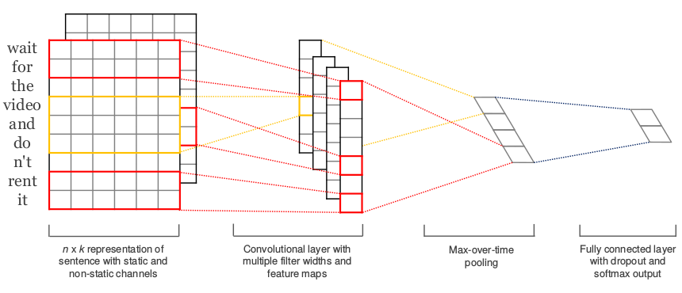

### Convolutional Neural Networks for Sentence Classification

论文地址: [http://www.aclweb.org/anthology/D14-1181](http://www.aclweb.org/anthology/D14-1181)

##### TL;DR

(14 年的论文) 提出了用于句子分类的单卷积层的 CNN 模型, 简单而强大.

##### Key Points

* 本文针对句子分类任务, 提出了一个极简 CNN 模型, 仅包含: embedding Layer x1, Conv Layer x1, Pooling Layer x1, FC x1, output layer x1.
* 不同于 CV 中使用的通常为 nxn 的 filter, CNN in NLP 使用的是横跨多个 word vector, 长度等同于 embedding_dim 的 filter. 一个 filter 对整个句子的 embedding matrix 计算一遍卷积之后, 得到特征向量: $\mathbf{c}=[c_1, c_2, \dots, c_{n-h+1}]$.
* 使用 max-over-time pooling, 实际就是从一个 filter 得到的特征向量中取最大值: $\hat{c}=max(\mathbf{c})$.
* 将多个 filter 得到的 $\hat{c}$ 们拼接, 构成下一层 FC 的输入. FC 中使用了 dropout, 并对参数做了 l2-norm.
* 文中还进行了一个多通道 word vector 的实验, 具体而言就是: 在输入层使用多个 embedding layer, 记为 multi-channel, filter 再对多个 embedding layer 做卷积, 就像 CV 一样. (如下)

* 文中采用了 4 种不同的 word vector 策略: 不使用预训练的, 使用预训练的但不 fine-tune, 使用预训练的并 fine-tune, 双通道(都使用预训练的, 一组不 fine-tune, 一组 fine-tune). 结果:
    * 多通道与单通道各有胜负;
    * fine-tune 通常能带来进一步的性能提升.
* 文章在 7 个不同的句子分类任务上进行了实验, 而本文提出的模型及其变种在 4 个上取得了当时 SOTA 的结果, 其中 3 个优势巨大. 证明了模型的有效性.

##### Notes/Questions

* Multi-channel in NLP 有点意思. 这说明道理都是差不多的, 知识是可以迁移的. Attention is All you Need 中的 Multi-Head 类似于 Multi-channel.
