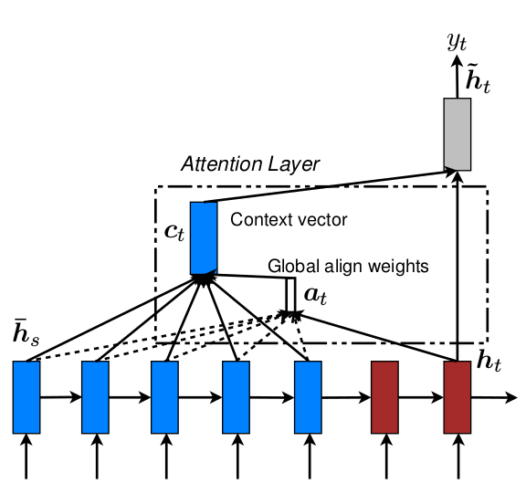
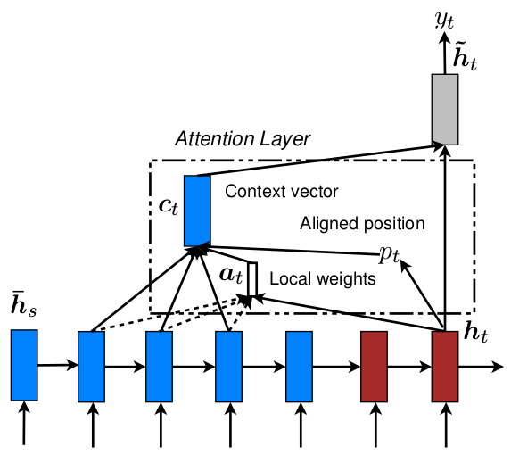

# [Effective Approaches to Attention-based Neural Machine Translation](https://arxiv.org/abs/1508.04025)

**TL;DR** 本文对 attention model 进行了考察, 提出 2 类 attention model: `global attention` 和 `local attention` 和 3 种计算对齐程度的方法. 顾名思义, global attention 考虑 source 的所有状态, local attention 仅考虑局部状态, 从而避免了 source 过长时巨大的计算开销. Local attention 需要估计对齐点, 文中介绍了 2 种方法: 1) 按位置递增法 ($p_t=t$); 2) 预测法 ($p_t=S\cdot sigmoid(v_p^T tanh(W_p h_t))$). 文章提出的 3 种 `alignment function` 分别是: 1) dot ($h_t^T \overline{h_s}$); 2) general ($h_t^T W_a \overline{h_s}$); 3) concat ($v_a^T tanh(W_a[h_t;\overline{h_s}])$). 此外, 文中还介绍了 `input-feeding approach`, 该方法能考虑 past alignment information 来帮助当前的 alignment 决策, 具体做法是将前一时刻的 `attention vector` $\tilde{h_{t-1}}$ 与当前时刻的 decoder 输入拼接, 再输入 decoder.

#### Key Points

* 提出了 2 类 attention model: global attention 和 local attention. 前者在 source 的所有状态上考虑 attention distribution; 后者只考虑局部范围内的 attention distribution.
* 提出了 3 种计算 decoder 状态 $h_t$ 和 encoder 状态 $h_s$ 的对齐程度方法:
    1. `dot`: $score(h_t, \overline{h_s})=h_t^T \overline{h_s}$;
    2. `general`: $score(h_t, \overline{h_s})=h_t^T W_a \overline{h_s}$;
    3. `concat`: $score(h_t, \overline{h_s})=v_a^T tanh(W_a[h_t;\overline{h_s}])$.
* (实际文中还提到了一种 location-based function: $score(h_t, \overline{h_s})=W_a h_t$, 甚至都没有考虑 source 的状态, 笔者不认为这是 attention.)
* 如上所示, 本文的 attention 计算流程是: $h_t\rightarrow a_t \rightarrow c_t \rightarrow \tilde{h_t}$. 相对于 Bahdanau 那篇的 $h_{t-1} \rightarrow a_t \rightarrow c_t \rightarrow h_t. 看上去更赏心悦目, 如作者所说也更简单.
* Local attention 是 soft attention 和 hard attention 的折中方法. 所谓 soft attention 就是 global attention, 只是本文为和 local 做区分换了个名字, 通过对所有相似度做 softmax, 每个状态都有相似概率, attention 连续可微; 而 hard attention 就是简单粗暴地取一个状态, attention 不连续不可微, 无法使用 BP 算法.
* Local attention 的具体方法是: 为每个 target word 生成一个对齐位置 $p_t$, 然后取其左右大小为 $D$ 的窗口计算 $c_t$. 由于 $D$ 是固定的, alignment vector $a_t$ 的是一个定长向量.
* 文中介绍了 2 种生成对齐位置的方法:
    1. `Monotonic alignment`: 此时假设 source 和 target 序列是单调对齐的, 即 target t+1 时刻的对齐状态在 t 时刻对齐状态之后;
    2. `Predictive alignment`: 此时使用一个预测模型来预测对齐位置. $p_t=S\cdot sigmoid(v_p^T tanh(W_p h_t))$ (此处 $S$ 是输入序列的长度). 然后以 $p_t$ 为中心, 以 `截断高斯分布 truncated gaussian distribution` 作为 attention distribution 计算 alignment vector: $a_t(s)=align(h_t, \overline{h_s}exp(-\frac{(s-p_t)^2}{2\sigma^2})$ (文中并没有将 $p_t$ 处理成整数, 但 $s$ 确是落在窗口内的整数)
* 受传统 MT 维护一个 coverage set 以追踪已经翻译的单词的启发, 文章提出了 `input-feeding approach`, 即在对齐决策时, 考虑过去已经使用过的对齐信息.
* Input-feeding approach 的做法很简单, 就是将 attention vector $\tilde{h_t}$ 作为 decoder 的一部分输入.
* 一些实验发现包括:
    * `perplexity` 与翻译质量强相关;
    * input-feeding approach 是有帮助的;
    * attention model 对 unknown words 也能学到有用的对齐信息 (基于使用 <unk> 替换低频词的实验结果比不使用该技术的结果更好):
    * global attention + dot 效果不错, general 与 local attention 更搭;
    * attention model 对于名字的对齐效果特好 (中文姓在前名在后, 英文名在前姓在后, 这样的关系);

* 下图分别是 global attention model 与 local attention model:

#### Notes/Questions

* 本文一些存疑的地方:
    * 文章提到论文 <show, attend and tell> 在目标函数中使用一个 additional constraint 来确保模型对图片所有部分有相同的关注度. 该方法的目的与效果有待观看那篇论文. 但本文说 input-feeding approach 能提供对于 additional constraints 的灵活选择, 语焉不详, 没理解.
    * 不知道该如何评价 attention model 对学习名字的超强能力. 在我看来, 名字是一个专有名字, 是一个整体, 该能力的用处有多大有待考量.
    * 文中使用了 `alignment error rate, AER` 指标来评估对齐的质量, 但具体做法没有介绍, 给了一个分数就了事了, 最后得出结论, AER 与翻译质量相关度不大, 让人着摸不透. 不如 Bahdanau 那篇上图来得直观.
* ...
* ...
