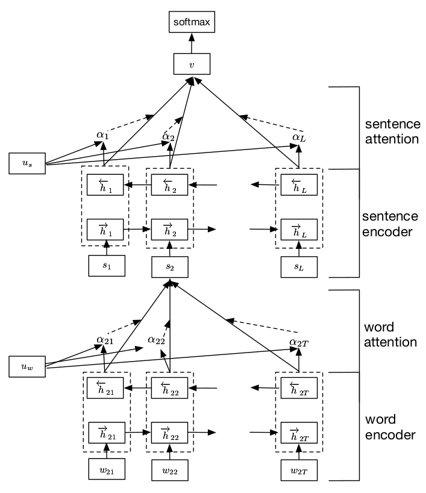

# [Hierarchical Attention Networks for Document Classification](https://www.cs.cmu.edu/~./hovy/papers/16HLT-hierarchical-attention-networks.pdf)

**TL;DR** 本文将 attention mechanism 引入 document classification 任务, 根据文档的分层特点 (word, sentence, document), 提出了 `hierarchical attention netword, HAN`. 文中使用了 word attention 和 sentence attention, 用对 word vectors 加权求和的方式来表示 sentence vector, 并用 sentence vectors 加权求和的方式表示 document, 最后执行分类.

#### Key Points

* HAN 提出的依据是: 文档是具有层次结构的, 单词组成句子, 句子构成文档; 文档各部分的重要性是不相同的, 不同单词和句子能表达不同的信息; 单词之间具有相关性, 不能完全独立地处理单词; 单词和句子的重要性与高度依赖于 context.
* 不同于 NMT, document classification 不存在 target, HAN 也没用 encoder-decoder 结构, 而是采用了 *word encoder-> word attention-> sentence encoder-> sentence attention* 的结构. 两个 *encoder-> attention* 的结构相同, 输入不同.
* HAN 使用一个可学习的 context vector, 类似于 attention-based NMT 中 decoder 的状态. 以 sentence attention 为例进行说明:
    1. 将 RNN 的状态送入 MLP 得到用于后续计算的 vector: $u_i=tanh(W_s h_i+b_s)$;
    2. 使用 $a_i=\frac{exp(u_i^T u_s)}{\Sigma_i exp(u_i^T us_)}$, 计算各 sentence vectors 的 attention weights ($u_s$ 即 sentence context vector);
    3. 通过加权求和 $v=\Sigma_i a_i h_i$ 得到 document vector.

#### Notes/Questions

* 本文的方法很直观, 就是利用文档的分层结构特点, 但效果也很显著. 实验证明了利用分层结构带来的裨益.
* 为什么要在 RNN 之后加一层 MLP, 让人有点匪夷所思 (有时间的话, 我会对比一下加不加 MLP 的效果)
* 文章提到 length-adjustment 能带来 3 倍速的训练速度提升. 所谓 length-adjustment 就是将长度相近的文档放进同一个 batch 中.
