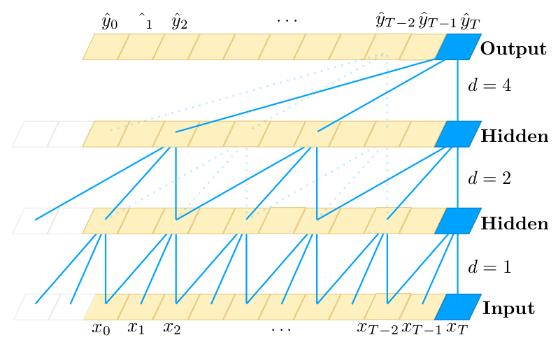

### [An Empirical Evaluation of Generic Convolutional and Recurrent Networks for Sequence Modeling](https://arxiv.org/abs/1803.01271)

#### TL;DR

本文就序列建模, 对 CNN 和 RNN 进行了比较. 按照文章的说法, 在 RNN 的主场打了一架, 结果 CNN 完爆 RNN. 使用的是, 针对序列建模特殊构造的 CNN, 称为 *Temporal Convolutional Network, TCN* 和普通 RNN, GRU, LSTM.

#### Key Points

* 为了比较 RNN 和 CNN 在 Sequence Modeling 上的性能, 文章构造了一种能用于序列建模的简单通用的 CNN 架构 TCN, 结合了 causal convolution, residual connection 和 dilation convolution.
* TCN 的典型特征是:
    1. 卷积是 causal 的, 未来的信息不会泄漏到过去;
    2. 能将任意长度的序列映射为相同长度的输出序列.
* 为实现第二个目标, TCN 使用一维全卷积结构, 通过 zero padding 使各层保持相同长度.
* 而所谓 causal convolution, 就是计算 t 时刻的输出时, 仅对前一层 t 时刻及之前的状态进行卷积.
* Causal convolution 的叠加, 高层的感受野野/历史信息与网络层数呈线性关系. 对于超长序列, 网络必须很深, 才能捕捉到足够长的历史信息. 针对这个问题, 文中使用了 dilation convolution, 使得随网络的加深, 高层的感受野呈指数扩大.
* Dilation convolution 的运算如下: $F(s)=\Sigma_{i=0}^{k-1}f(i)\cdot \bold{x}_{s-d\cdot i}$ ($\bold{x}$ 表示输入序列, f 表示 filter, d 是 dilation factor, k 是 filter size, $s-d\cdot i$ 意味着只对过去的状态作卷积). 看图最直观.

* TCN 的感受野依赖于上式中的 dilation factor d 和 filter/kernel size k, 以及网络深度 n. 为获得足够大的感受野, TCN 还是不得不增加网络的深度, 因此它构造了残差单元来训练更深的网络. (残差单元在 ResNet 的笔记中有详细介绍)

* TCN 在序列建模方面的优势是:
    * 可并行性 (只要抛弃了 RNN, 神经网络基本都具有了这一优点);
    * 通过调整 n, k, d, 可灵活地控制感受野, 能适应不同任务 (有些任务要求解决超长期依赖, 有些任务更依赖短期依赖);
    * 稳定的梯度 (同样地, 只要抛弃了 RNN, 时间传播方向上的梯度爆炸/消失问题就自然解决了);
    * 训练时的低内存占用 (参数共享, 以及只存在沿网络方向的反向传播带来的裨益).
* TCN 的缺点:
    * 推断时, 需要更多的内存 (此时 RNN 只需要维护一个 hidden state, 每次接受一个输入; 而 TCN 要保持一个足够长的序列, 以保留历史状态);
    * 迁移的困难性 (不同领域任务对感受野的大小不同, 使用小 k 和小 d 学好的模型难以应用于需要大 k 和大 d 的任务).
* 文章将 TCN 与普通 RNN, GRU, LSTM 进行比较,并没有刻意选择在各任务上 SOTA 的模型. 实验证明,TCN 基本完爆 RNN 们.
* 理论上 RNN 具有无限大的记忆, 即能保持无限长度之外的信息, 实际效果并不如何好. 反而 TCN 能维持长得多的历史信息.
* 在绝大多数任务上, 使用 gradient clipping 能起到 regularization 的作用, 并加速收敛.
* TCN 对超参数的选择相对不敏感, 只要能保持一个充分大小的有效感受野即可.
* 正文部分的实验使用 ReLU 而没有使用门控单元. 附录的实验表明, GLU 在特定任务上能进一步提升 TCN 的性能, 但在另一些任务上并没有带来更好的结果
* 使用门控激活单元, 会使模型的复杂度增大一倍. (如在 ConvS2S 中提到的, 门控单元要求 CNN 的输出维数是输入的两倍)

#### Notes/Questions

* 理论上 RNN 能保持无限的记忆, 但是它的做法和计算机表示浮点数一样, 用有限来表示无限, 这不可避免地带来了精度损失/记忆遗失.
* 计算机的思维方式和人是完全不同的, 我们需要前些时刻的记忆来作决策, 我们的记忆会遗忘; 但计算机不会遗忘, 只要不限制存储空间, 每个时刻记录一个记忆, 它能保持超长的记忆, 而且每段记忆都是"真真切切的".
* 过去 RNN 流行, 我觉得一个原因可能是计算机性能有限, 用一个向量来表示记忆的开销较小, 是较好的选择. 但现在我们有了更大的存储空间, 保持足够长的记忆是很轻易的事情, 相反 RNN 的不可并行性是硬伤.
* 也许 RNN 真的可以走下历史舞台了.
