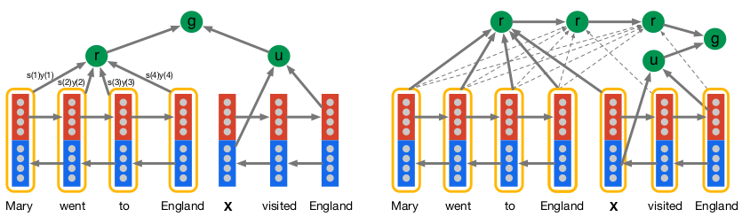

### Teaching Machines to Read and Comprehend

论文地址: [https://arxiv.org/abs/1506.03340](https://arxiv.org/abs/1506.03340)

#### TL;DR

本文提出两个 attnention-based 机器阅读模型: attentive reader 和 impatient reader. 实验表明: attention 是机器阅读/QA 中关键要素, 因为比 RNN 能传递更长期的依赖.

#### Key Points

* 本文提出了两个 attention-based reader models
* attentive reader:
    1. 将 context 和 question 通过两个分离的 Bi-LSTM 进行编码. 对于 question encoder, 将最后的前向/反向输出拼接作为 question 的表示, 记作 u;
    2. 对于 context, 每个时刻的前向/反向输出都作拼接, 得到一个序列. 以 u 为 query, context encoder 的输出序列为 key 和 value, 进行 attention 的计算, 得到输出序列的加权和, 作为 context 的表示, 记作 r;
    3. 最后通过一个非线性结合计算 answer: $g^{AR}(d, q)=tanh(W_{rg}r+W_{ug}u)$.
* impatient reader: 与 attention reader 不同之处在于 attention 的计算方式, question 的每个单词都用于计算 attention, 此时得到的 context 的表示 r 是长度与 question 等长的序列, 且第 i 时刻的 r(i) 依赖于 r(i-1): $r(i)=y_d^T s(i)+tanh(W_{rr} r(i-1))$ ($s(i) 表示第 i 个question 单词计算得到 attention weight$
* impatient reader 的设计模拟了人阅读的做法: 时不时地回过头去文本中搜索答案, 保留 r(i) 对 r(i-1) 的依赖就是 RNN 的一个实现.

#### Notes/Questions

* 本文使用的两个 baselines 挺有意思的, 第一个直接选择 context 中最频繁出现的词, 第二个在第一个的基础上, 排除在 query 中出现的词. 后者的理由是出题人不会在 query 提到一个词两次. 这就变成三短一长选长的玄学了呀.
* 文中科普了一些 QA 的传统方法:
    * Frame-Semantic Parsing: 通过识别谓词及其变化, 让模型学到"who did what to whom"的知识(baseline);
    * Word distance benchmark: 该方法将 question 中挖掉的词和 context 中可能的实体进行对齐, 即以可能对齐的实体为锚点, 度量 question 与 context 的相似度, 具体方法是: 计算 question 中每个单词到与 context 中与它们对齐的最近的词的距离之和 (baseline);
    * Deep LSTM encoder: 将 context 和 question 通过一个 delimiter 连接作为模型输入, context 在前或 question 在前都可以, 使用 skip connection (baseline);
